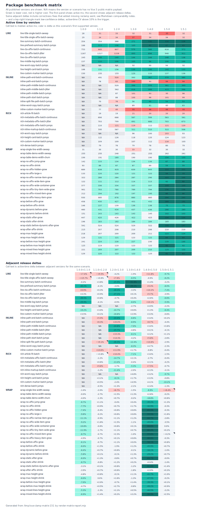

# Package benchmark matrix

This report compares the public component benchmark matrix across package versions. The primary timing signal is `active ms`; `settled ms` preserves the end-to-end quiet-frame timing, counters explain whether a change came from layout reads, DOM cloning/replacement, or slot rendering, and sample CV / RME report active timing variance.

Generated from `/tmp/vue-clamp-matrix-151`.

## Version summary

| Version | Scenarios | Samples | Sample wall ms | Sample active ms | Median active CV | Max active CV | Median active RME | Max active RME | Active ms | Settled ms | Quiet ms | Rect reads | Item slot calls | Long tasks |
| ------- | --------: | ------: | -------------: | ---------------: | ---------------: | ------------: | ----------------: | -------------: | --------: | ---------: | -------: | ---------: | --------------: | ---------: |
| 1.0.0   |     37/56 |       5 |         2237.0 |           1177.0 |             1.3% |         10.6% |              1.4% |          13.2% |   11340.1 |    24094.0 |  12736.6 |     945140 |          989168 |         40 |
| 1.1.0   |     49/56 |       4 |         2131.3 |           1082.0 |             1.7% |         15.2% |              2.1% |          18.9% |   13886.5 |    36533.5 |  22666.7 |     965663 |          989168 |         36 |
| 1.2.0   |     53/56 |       4 |         2125.9 |           1094.4 |             1.8% |         10.0% |              2.1% |          12.4% |   15211.3 |    43343.9 |  28160.4 |     970463 |          989168 |         35 |
| 1.3.0   |     56/56 |       4 |         2126.8 |           1000.1 |             1.8% |          6.9% |              2.2% |          12.8% |   14174.4 |    44815.8 |  30651.8 |     971183 |          989168 |         35 |
| 1.4.0   |     56/56 |       4 |         2126.4 |           1004.4 |             1.4% |          8.9% |              2.0% |          14.2% |   13862.4 |    44838.9 |  30961.1 |     970191 |          989168 |         34 |
| 1.5.0   |     56/56 |       5 |         2100.2 |            797.6 |             2.1% |          8.4% |              2.5% |          12.5% |   10162.9 |    40993.7 |  30817.6 |     407471 |          297068 |         29 |
| 1.5.1   |     56/56 |       5 |         2079.3 |            796.0 |             1.9% |         10.4% |              2.3% |          15.4% |    9952.4 |    40932.6 |  30984.1 |     407439 |          297068 |         29 |

## Adjacent release summary

| From  | To    | Comparable scenarios | Active delta |          Active ms | Rect delta | Slot delta | Settled delta | Long task delta |
| ----- | ----- | -------------------: | -----------: | -----------------: | ---------: | ---------: | ------------: | --------------: |
| 1.0.0 | 1.1.0 |                37/56 |        -6.1% | 11340.1 -> 10649.7 |      +0.2% |       0.0% |         -8.9% |          -11.3% |
| 1.1.0 | 1.2.0 |                49/56 |        +0.4% | 13886.5 -> 13945.2 |      +0.0% |       0.0% |         -0.0% |           -2.8% |
| 1.2.0 | 1.3.0 |                53/56 |        -8.6% | 15211.3 -> 13897.5 |      -0.1% |       0.0% |         +0.1% |           +1.4% |
| 1.3.0 | 1.4.0 |                56/56 |        -2.2% | 14174.4 -> 13862.4 |      -0.1% |       0.0% |         +0.1% |           -2.9% |
| 1.4.0 | 1.5.0 |                56/56 |       -26.7% | 13862.4 -> 10162.9 |     -58.0% |     -70.0% |         -8.6% |          -16.2% |
| 1.5.0 | 1.5.1 |                56/56 |        -2.1% |  10162.9 -> 9952.4 |      -0.0% |       0.0% |         -0.1% |           +1.8% |

## Active time matrix

| Component     | Scenario                              |  1.0.0 |  1.1.0 |  1.2.0 | 1.3.0 | 1.4.0 | 1.5.0 | 1.5.1 |
| ------------- | ------------------------------------- | -----: | -----: | -----: | ----: | ----: | ----: | ----: |
| LineClamp     | line-title-single-batch-sweep         |   28.4 |   30.5 |   33.4 |  32.0 |  31.4 |  35.1 |  31.7 |
| LineClamp     | line-title-single-affix-batch-sweep   |   29.3 |   33.9 |   34.1 |  36.7 |  34.3 |  34.0 |  31.9 |
| LineClamp     | line-summary-batch-continuous         |  354.1 |  353.5 |  366.3 | 271.3 | 130.6 | 132.4 | 128.2 |
| LineClamp     | line-prefixed-summary-batch-jumps     |  188.3 |  112.6 |  108.0 | 104.9 |  42.8 |  46.8 |  43.0 |
| LineClamp     | line-cta-affix-batch-continuous       |  752.9 |  804.9 |  807.4 | 579.1 | 560.2 | 617.6 | 571.7 |
| LineClamp     | line-cta-affix-batch-jitter           | 1167.0 | 1217.0 | 1228.4 | 895.1 | 896.4 | 947.9 | 911.4 |
| LineClamp     | line-cta-affix-batch-jumps            |  244.6 |  147.9 |  149.1 | 143.6 | 144.2 | 147.9 | 138.2 |
| LineClamp     | line-middle-log-batch-jumps           |  157.1 |  110.0 |  105.5 | 104.5 |  96.1 | 105.8 |  99.6 |
| LineClamp     | line-word-copy-batch-jumps            |    N/A |    N/A |    N/A |  92.4 |  90.0 |  94.4 |  92.4 |
| LineClamp     | line-height-card-batch-jumps          |  187.6 |  151.5 |  156.0 | 139.2 | 140.1 | 141.9 | 132.7 |
| LineClamp     | line-custom-marker-batch-jumps        |  149.6 |  154.8 |  154.9 | 128.9 | 132.7 | 137.1 | 136.3 |
| InlineClamp   | inline-path-end-batch-continuous      |    N/A |  490.8 |  519.9 | 393.1 | 367.0 | 379.4 | 380.0 |
| InlineClamp   | inline-path-end-batch-jumps           |    N/A |   78.1 |   83.0 |  99.6 |  90.7 |  98.6 |  94.2 |
| InlineClamp   | inline-path-middle-batch-continuous   |    N/A |    N/A |  528.9 | 397.9 | 369.9 | 380.9 | 394.6 |
| InlineClamp   | inline-path-middle-batch-jitter       |    N/A |    N/A |  562.4 | 417.9 | 398.6 | 414.9 | 398.0 |
| InlineClamp   | inline-path-middle-batch-jumps        |    N/A |    N/A |   87.3 | 100.7 |  92.5 |  94.6 |  95.6 |
| InlineClamp   | inline-path-start-batch-jumps         |    N/A |    N/A |   87.6 | 100.1 |  95.9 | 101.5 |  98.8 |
| InlineClamp   | inline-split-file-path-batch-jumps    |    N/A |   69.6 |   75.9 |  56.0 |  49.0 |  54.2 |  52.6 |
| InlineClamp   | inline-word-copy-batch-jumps          |    N/A |    N/A |    N/A |  88.9 |  81.5 |  85.4 |  83.4 |
| InlineClamp   | inline-custom-marker-batch-jumps      |    N/A |   76.6 |   84.8 |  94.9 |  96.5 |  95.7 |  95.4 |
| RichLineClamp | rich-article-fit-batch                |    N/A |   18.5 |   19.2 |  21.2 |  19.7 |  20.3 |  20.0 |
| RichLineClamp | rich-metadata-affix-batch-continuous  |    N/A |  696.3 |  687.6 | 586.5 | 599.1 | 583.1 | 580.7 |
| RichLineClamp | rich-metadata-affix-batch-jitter      |    N/A |  793.5 |  798.6 | 691.3 | 688.3 | 702.6 | 673.2 |
| RichLineClamp | rich-metadata-affix-batch-jumps       |    N/A |  109.7 |  120.5 | 118.5 | 112.2 | 120.6 | 119.8 |
| RichLineClamp | rich-inline-markup-batch-continuous   |    N/A |  594.7 |  587.4 | 520.5 | 510.2 | 521.8 | 505.6 |
| RichLineClamp | rich-word-copy-batch-jumps            |    N/A |    N/A |    N/A |  95.5 | 100.1 | 103.4 |  93.3 |
| RichLineClamp | rich-height-card-batch-jumps          |    N/A |  121.7 |  125.5 | 117.9 | 119.9 | 123.8 | 122.8 |
| RichLineClamp | rich-custom-marker-batch-jumps        |    N/A |  108.6 |  109.2 | 106.6 | 111.8 | 116.4 | 104.5 |
| RichLineClamp | rich-dense-batch-jumps                |    N/A |   78.7 |   78.3 |  79.3 |  77.6 |  79.5 |  78.5 |
| WrapClamp     | wrap-single-line-width-sweep          |   30.8 |   30.5 |   29.9 |  32.5 |  32.0 |  29.8 |  31.7 |
| WrapClamp     | wrap-table-demo-width-sweep           |  254.6 |  254.6 |  247.6 | 251.4 | 254.6 | 261.8 | 261.2 |
| WrapClamp     | wrap-table-demo-width-churn           |  199.1 |  191.1 |  188.6 | 190.0 | 189.6 | 153.9 | 154.8 |
| WrapClamp     | wrap-no-affix-jump-grow               |  142.4 |  132.8 |  134.2 | 133.6 | 134.1 |  86.8 |  87.9 |
| WrapClamp     | wrap-no-affix-shrink                  |   92.9 |   85.8 |   86.6 |  87.2 |  88.7 |  59.5 |  59.3 |
| WrapClamp     | wrap-no-affix-hidden-grow             |  688.5 |  637.5 |  635.2 | 639.1 | 642.8 | 221.9 | 221.3 |
| WrapClamp     | wrap-no-affix-large-n                 |  133.1 |  120.4 |  120.1 | 120.8 | 121.6 |  54.2 |  55.0 |
| WrapClamp     | wrap-no-affix-narrow-item-grow        |  321.9 |  286.3 |  283.6 | 286.7 | 290.1 | 102.5 |  99.7 |
| WrapClamp     | wrap-no-affix-wide-item-grow          |  121.9 |  110.7 |  112.4 | 114.0 | 112.9 |  62.1 |  60.0 |
| WrapClamp     | wrap-no-affix-wide-container-grow     |  376.9 |  336.3 |  334.3 | 337.0 | 337.4 | 105.2 | 105.2 |
| WrapClamp     | wrap-no-affix-tiny-item-wide-grow     |  900.6 |  793.3 |  779.8 | 788.5 | 794.0 | 155.8 | 156.1 |
| WrapClamp     | wrap-no-affix-mixed-item-grow         |  212.0 |  193.5 |  192.2 | 196.6 | 194.6 |  86.0 |  85.9 |
| WrapClamp     | wrap-no-affix-heavy-item-grow         |  930.0 |  884.7 |  878.4 | 879.6 | 884.5 | 293.8 | 292.8 |
| WrapClamp     | wrap-before-affix-grow                |  458.0 |  430.1 |  426.9 | 431.4 | 431.6 | 189.4 | 191.0 |
| WrapClamp     | wrap-before-affix-shrink              |  145.6 |  136.9 |  138.9 | 136.2 | 137.9 |  74.6 |  75.1 |
| WrapClamp     | wrap-dynamic-before-grow              |  460.3 |  431.1 |  434.1 | 436.5 | 436.1 | 287.6 | 284.8 |
| WrapClamp     | wrap-dynamic-before-shrink            |  151.1 |  142.7 |  142.9 | 142.7 | 144.6 | 102.4 | 103.1 |
| WrapClamp     | wrap-static-after-grow                |  447.1 |  420.3 |  425.7 | 422.2 | 425.3 | 154.4 | 154.3 |
| WrapClamp     | wrap-static-after-shrink              |  196.2 |  183.1 |  181.7 | 183.9 | 184.3 | 185.1 | 182.7 |
| WrapClamp     | wrap-static-before-dynamic-after-grow |  540.7 |  523.9 |  524.4 | 528.8 | 522.3 | 194.5 | 197.2 |
| WrapClamp     | wrap-after-affix-shrink               |  215.4 |  207.0 |  208.4 | 209.5 | 205.8 | 209.9 | 210.4 |
| WrapClamp     | wrap-max-height-grow                  |  217.8 |  207.3 |  209.0 | 208.7 | 210.9 | 122.9 | 124.1 |
| WrapClamp     | wrap-max-height-shrink                |  129.0 |  121.3 |  121.3 | 123.3 | 121.7 |  63.9 |  63.8 |
| WrapClamp     | wrap-before-max-height-grow           |  240.6 |  223.7 |  228.2 | 226.5 | 229.6 | 139.4 | 139.6 |
| WrapClamp     | wrap-before-max-height-shrink         |  124.8 |  118.9 |  119.4 | 122.7 | 121.7 |  61.9 |  62.4 |
| WrapClamp     | wrap-mixed-lines-height-grow          |  220.9 |  209.2 |  206.5 | 208.7 | 209.7 | 124.7 | 122.0 |
| WrapClamp     | wrap-mixed-lines-height-shrink        |  129.2 |  120.3 |  121.9 | 122.2 | 124.8 |  61.3 |  62.9 |

## Adjacent active delta matrix

| Component     | Scenario                              | 1.0.0 -> 1.1.0 | 1.1.0 -> 1.2.0 | 1.2.0 -> 1.3.0 | 1.3.0 -> 1.4.0 | 1.4.0 -> 1.5.0 | 1.5.0 -> 1.5.1 |
| ------------- | ------------------------------------- | -------------: | -------------: | -------------: | -------------: | -------------: | -------------: |
| LineClamp     | line-title-single-batch-sweep         |         ~+7.4% |         ~+9.5% |          -4.2% |          -1.9% |         +11.8% |          -9.7% |
| LineClamp     | line-title-single-affix-batch-sweep   |        ~+15.7% |         ~+0.6% |          +7.6% |          -6.5% |          -0.9% |          -6.2% |
| LineClamp     | line-summary-batch-continuous         |          -0.2% |          +3.6% |         -25.9% |         -51.9% |          +1.4% |          -3.2% |
| LineClamp     | line-prefixed-summary-batch-jumps     |         -40.2% |          -4.1% |          -3.0% |         -59.2% |          +9.3% |          -8.0% |
| LineClamp     | line-cta-affix-batch-continuous       |          +6.9% |          +0.3% |         -28.3% |          -3.3% |         +10.2% |          -7.4% |
| LineClamp     | line-cta-affix-batch-jitter           |          +4.3% |          +0.9% |         -27.1% |          +0.1% |          +5.7% |          -3.9% |
| LineClamp     | line-cta-affix-batch-jumps            |         -39.5% |          +0.8% |          -3.7% |          +0.4% |          +2.6% |          -6.6% |
| LineClamp     | line-middle-log-batch-jumps           |         -29.9% |          -4.1% |          -0.9% |          -8.0% |         +10.1% |          -5.9% |
| LineClamp     | line-word-copy-batch-jumps            |            N/A |            N/A |            N/A |          -2.7% |          +4.9% |          -2.2% |
| LineClamp     | line-height-card-batch-jumps          |         -19.2% |          +3.0% |         -10.7% |          +0.6% |          +1.3% |          -6.4% |
| LineClamp     | line-custom-marker-batch-jumps        |          +3.5% |          +0.1% |         -16.8% |          +2.9% |          +3.3% |          -0.6% |
| InlineClamp   | inline-path-end-batch-continuous      |            N/A |          +5.9% |         -24.4% |          -6.6% |          +3.4% |          +0.2% |
| InlineClamp   | inline-path-end-batch-jumps           |            N/A |          +6.3% |         +20.0% |          -8.9% |          +8.7% |          -4.4% |
| InlineClamp   | inline-path-middle-batch-continuous   |            N/A |            N/A |         -24.8% |          -7.0% |          +3.0% |          +3.6% |
| InlineClamp   | inline-path-middle-batch-jitter       |            N/A |            N/A |         -25.7% |          -4.6% |          +4.1% |          -4.1% |
| InlineClamp   | inline-path-middle-batch-jumps        |            N/A |            N/A |         +15.3% |          -8.1% |          +2.2% |          +1.1% |
| InlineClamp   | inline-path-start-batch-jumps         |            N/A |            N/A |         +14.3% |          -4.2% |          +5.8% |          -2.6% |
| InlineClamp   | inline-split-file-path-batch-jumps    |            N/A |         ~+9.1% |         -26.3% |         -12.4% |         +10.6% |          -2.9% |
| InlineClamp   | inline-word-copy-batch-jumps          |            N/A |            N/A |            N/A |          -8.3% |          +4.7% |          -2.3% |
| InlineClamp   | inline-custom-marker-batch-jumps      |            N/A |         +10.6% |         +11.9% |          +1.7% |          -0.8% |          -0.4% |
| RichLineClamp | rich-article-fit-batch                |            N/A |         ~+3.8% |         +10.4% |          -7.1% |          +3.0% |          -1.5% |
| RichLineClamp | rich-metadata-affix-batch-continuous  |            N/A |          -1.2% |         -14.7% |          +2.1% |          -2.7% |          -0.4% |
| RichLineClamp | rich-metadata-affix-batch-jitter      |            N/A |          +0.6% |         -13.4% |          -0.4% |          +2.1% |          -4.2% |
| RichLineClamp | rich-metadata-affix-batch-jumps       |            N/A |          +9.8% |          -1.7% |          -5.3% |          +7.5% |          -0.7% |
| RichLineClamp | rich-inline-markup-batch-continuous   |            N/A |          -1.2% |         -11.4% |          -2.0% |          +2.3% |          -3.1% |
| RichLineClamp | rich-word-copy-batch-jumps            |            N/A |            N/A |            N/A |          +4.8% |          +3.2% |          -9.7% |
| RichLineClamp | rich-height-card-batch-jumps          |            N/A |          +3.1% |          -6.1% |          +1.7% |          +3.3% |          -0.8% |
| RichLineClamp | rich-custom-marker-batch-jumps        |            N/A |          +0.5% |          -2.4% |          +4.9% |          +4.1% |         -10.2% |
| RichLineClamp | rich-dense-batch-jumps                |            N/A |          -0.5% |          +1.3% |          -2.1% |          +2.4% |          -1.3% |
| WrapClamp     | wrap-single-line-width-sweep          |          -1.0% |          -2.0% |          +8.7% |          -1.5% |          -6.9% |         ~+6.4% |
| WrapClamp     | wrap-table-demo-width-sweep           |          -0.0% |          -2.7% |          +1.5% |          +1.3% |          +2.8% |          -0.2% |
| WrapClamp     | wrap-table-demo-width-churn           |          -4.0% |          -1.3% |          +0.7% |          -0.2% |         -18.8% |          +0.6% |
| WrapClamp     | wrap-no-affix-jump-grow               |          -6.7% |          +1.1% |          -0.4% |          +0.4% |         -35.2% |          +1.3% |
| WrapClamp     | wrap-no-affix-shrink                  |          -7.7% |          +0.9% |          +0.7% |          +1.7% |         -32.9% |          -0.3% |
| WrapClamp     | wrap-no-affix-hidden-grow             |          -7.4% |          -0.4% |          +0.6% |          +0.6% |         -65.5% |          -0.3% |
| WrapClamp     | wrap-no-affix-large-n                 |          -9.6% |          -0.2% |          +0.6% |          +0.6% |         -55.5% |          +1.6% |
| WrapClamp     | wrap-no-affix-narrow-item-grow        |         -11.1% |          -0.9% |          +1.1% |          +1.2% |         -64.7% |          -2.8% |
| WrapClamp     | wrap-no-affix-wide-item-grow          |          -9.2% |          +1.6% |          +1.5% |          -1.1% |         -45.0% |          -3.5% |
| WrapClamp     | wrap-no-affix-wide-container-grow     |         -10.8% |          -0.6% |          +0.8% |          +0.1% |         -68.8% |           0.0% |
| WrapClamp     | wrap-no-affix-tiny-item-wide-grow     |         -11.9% |          -1.7% |          +1.1% |          +0.7% |         -80.4% |          +0.2% |
| WrapClamp     | wrap-no-affix-mixed-item-grow         |          -8.7% |          -0.7% |          +2.3% |          -1.0% |         -55.8% |         ~-0.2% |
| WrapClamp     | wrap-no-affix-heavy-item-grow         |          -4.9% |          -0.7% |          +0.1% |          +0.6% |         -66.8% |          -0.3% |
| WrapClamp     | wrap-before-affix-grow                |          -6.1% |          -0.7% |          +1.1% |          +0.0% |         -56.1% |          +0.8% |
| WrapClamp     | wrap-before-affix-shrink              |          -6.0% |          +1.5% |          -1.9% |          +1.2% |         -45.9% |          +0.7% |
| WrapClamp     | wrap-dynamic-before-grow              |          -6.4% |          +0.7% |          +0.6% |          -0.1% |         -34.1% |          -1.0% |
| WrapClamp     | wrap-dynamic-before-shrink            |          -5.6% |          +0.1% |          -0.1% |          +1.3% |         -29.2% |          +0.7% |
| WrapClamp     | wrap-static-after-grow                |          -6.0% |          +1.3% |          -0.8% |          +0.7% |         -63.7% |          -0.0% |
| WrapClamp     | wrap-static-after-shrink              |          -6.7% |          -0.8% |          +1.2% |          +0.2% |          +0.4% |          -1.4% |
| WrapClamp     | wrap-static-before-dynamic-after-grow |          -3.1% |          +0.1% |          +0.8% |          -1.2% |         -62.8% |          +1.4% |
| WrapClamp     | wrap-after-affix-shrink               |          -3.9% |          +0.7% |          +0.6% |          -1.8% |          +2.0% |          +0.3% |
| WrapClamp     | wrap-max-height-grow                  |          -4.8% |          +0.8% |          -0.1% |          +1.1% |         -41.7% |          +1.0% |
| WrapClamp     | wrap-max-height-shrink                |          -6.0% |           0.0% |          +1.6% |          -1.3% |         -47.5% |          -0.2% |
| WrapClamp     | wrap-before-max-height-grow           |          -7.0% |          +2.0% |          -0.7% |          +1.4% |         -39.3% |          +0.1% |
| WrapClamp     | wrap-before-max-height-shrink         |          -4.7% |          +0.5% |          +2.7% |          -0.8% |         -49.2% |          +0.9% |
| WrapClamp     | wrap-mixed-lines-height-grow          |          -5.3% |          -1.3% |          +1.1% |          +0.5% |         -40.5% |          -2.2% |
| WrapClamp     | wrap-mixed-lines-height-shrink        |          -6.9% |          +1.4% |          +0.2% |          +2.2% |         -50.9% |          +2.5% |

## Correctness and comparability notes

A faster older version is not automatically a performance win. When a release added missing reclamp coverage or fixed incorrect output, the extra work is correctness cost and the scenario should be interpreted with that caveat.

### 1.0.0 -> 1.1.0

- RichLineClamp was added in 1.1.0, so rich scenarios are unsupported in 1.0.0 and excluded from pair deltas.
- InlineClamp 1.0 used a native text-overflow implementation, so measured InlineClamp rows start later and 1.0.0 is rendered as N/A for those scenarios.
- LineClamp fixed wrapped-line undercount edge cases, so LineClamp deltas may include newly-correct reclamp work.

### 1.1.0 -> 1.2.0

- InlineClamp added location handling and fixed meaningful split-boundary spaces; InlineClamp deltas include behavior changes, not only speed changes.

### 1.2.0 -> 1.3.0

- Boundary-aware clamping and smoother resizing landed in 1.3.0, so deltas for resize-heavy line, rich, and inline scenarios can include broader invalidation coverage.

### 1.3.0 -> 1.4.0

- LineClamp gained a native multiline path for eligible default end-ellipsis cases; LineClamp deltas can reflect an implementation-path change rather than a generic solver change.

### 1.4.0 -> 1.5.0

- The benchmark matrix always uses WrapClamp's public item slot, matching the 1.5.0 contract; large WrapClamp changes should be interpreted together with rect-read and slot-call counters.

## Top movers by adjacent release

### 1.0.0 -> 1.1.0

| Component | Scenario                            | Active delta |      Active ms |     Active RME | Confidence                | Rect delta | Slot delta | Settled delta |
| --------- | ----------------------------------- | -----------: | -------------: | -------------: | ------------------------- | ---------: | ---------: | ------------: |
| LineClamp | line-prefixed-summary-batch-jumps   |       -40.2% | 188.3 -> 112.6 |   3.6% -> 5.7% | normal                    |       0.0% |        N/A |        -23.7% |
| LineClamp | line-cta-affix-batch-jumps          |       -39.5% | 244.6 -> 147.9 |   1.2% -> 7.5% | normal                    |       0.0% |        N/A |        -23.5% |
| LineClamp | line-middle-log-batch-jumps         |       -29.9% | 157.1 -> 110.0 |   4.7% -> 5.4% | normal                    |      +9.1% |        N/A |        -20.4% |
| LineClamp | line-height-card-batch-jumps        |       -19.2% | 187.6 -> 151.5 |   0.7% -> 2.8% | normal                    |     +10.3% |        N/A |        -20.5% |
| LineClamp | line-title-single-affix-batch-sweep |      ~+15.7% |   29.3 -> 33.9 | 13.2% -> 12.7% | low (high active-time CV) |       0.0% |        N/A |         +0.2% |
| WrapClamp | wrap-no-affix-tiny-item-wide-grow   |       -11.9% | 900.6 -> 793.3 |   1.2% -> 4.2% | normal                    |       0.0% |       0.0% |        -11.0% |
| WrapClamp | wrap-no-affix-narrow-item-grow      |       -11.1% | 321.9 -> 286.3 |   2.3% -> 1.5% | normal                    |       0.0% |       0.0% |        -10.4% |
| WrapClamp | wrap-no-affix-wide-container-grow   |       -10.8% | 376.9 -> 336.3 |   3.1% -> 0.5% | normal                    |       0.0% |       0.0% |        -11.0% |

### 1.1.0 -> 1.2.0

| Component     | Scenario                           | Active delta |      Active ms |    Active RME | Confidence                | Rect delta | Slot delta | Settled delta |
| ------------- | ---------------------------------- | -----------: | -------------: | ------------: | ------------------------- | ---------: | ---------: | ------------: |
| InlineClamp   | inline-custom-marker-batch-jumps   |       +10.6% |   76.6 -> 84.8 |  9.6% -> 7.0% | normal                    |       0.0% |        N/A |         +0.2% |
| RichLineClamp | rich-metadata-affix-batch-jumps    |        +9.8% | 109.7 -> 120.5 |  6.8% -> 3.9% | normal                    |       0.0% |        N/A |         +0.3% |
| LineClamp     | line-title-single-batch-sweep      |       ~+9.5% |   30.5 -> 33.4 | 18.9% -> 7.2% | low (high active-time CV) |       0.0% |        N/A |         -0.0% |
| InlineClamp   | inline-split-file-path-batch-jumps |       ~+9.1% |   69.6 -> 75.9 | 17.8% -> 6.7% | low (high active-time CV) |       0.0% |        N/A |         -0.2% |
| InlineClamp   | inline-path-end-batch-jumps        |        +6.3% |   78.1 -> 83.0 |  5.8% -> 3.8% | normal                    |       0.0% |        N/A |         +0.1% |
| InlineClamp   | inline-path-end-batch-continuous   |        +5.9% | 490.8 -> 519.9 |  3.3% -> 0.7% | normal                    |       0.0% |        N/A |         +0.1% |
| LineClamp     | line-middle-log-batch-jumps        |        -4.1% | 110.0 -> 105.5 |  5.4% -> 4.9% | normal                    |       0.0% |        N/A |         +0.2% |
| LineClamp     | line-prefixed-summary-batch-jumps  |        -4.1% | 112.6 -> 108.0 |  5.7% -> 6.8% | normal                    |       0.0% |        N/A |         -0.1% |

### 1.2.0 -> 1.3.0

| Component   | Scenario                            | Active delta |       Active ms |    Active RME | Confidence | Rect delta | Slot delta | Settled delta |
| ----------- | ----------------------------------- | -----------: | --------------: | ------------: | ---------- | ---------: | ---------: | ------------: |
| LineClamp   | line-cta-affix-batch-continuous     |       -28.3% |  807.4 -> 579.1 |  0.7% -> 5.3% | normal     |       0.0% |        N/A |         -0.1% |
| LineClamp   | line-cta-affix-batch-jitter         |       -27.1% | 1228.4 -> 895.1 |  2.3% -> 1.0% | normal     |       0.0% |        N/A |         +0.2% |
| InlineClamp | inline-split-file-path-batch-jumps  |       -26.3% |    75.9 -> 56.0 |  6.7% -> 5.5% | normal     |       0.0% |        N/A |         -0.1% |
| LineClamp   | line-summary-batch-continuous       |       -25.9% |  366.3 -> 271.3 |  2.0% -> 4.4% | normal     |       0.0% |        N/A |         -0.0% |
| InlineClamp | inline-path-middle-batch-jitter     |       -25.7% |  562.4 -> 417.9 | 10.8% -> 3.3% | normal     |       0.0% |        N/A |         +0.0% |
| InlineClamp | inline-path-middle-batch-continuous |       -24.8% |  528.9 -> 397.9 |  2.0% -> 4.0% | normal     |       0.0% |        N/A |         -0.1% |
| InlineClamp | inline-path-end-batch-continuous    |       -24.4% |  519.9 -> 393.1 |  0.7% -> 1.3% | normal     |       0.0% |        N/A |         -0.1% |
| InlineClamp | inline-path-end-batch-jumps         |       +20.0% |    83.0 -> 99.6 |  3.8% -> 7.3% | normal     |       0.0% |        N/A |         -0.1% |

### 1.3.0 -> 1.4.0

| Component     | Scenario                           | Active delta |      Active ms |    Active RME | Confidence | Rect delta | Slot delta | Settled delta |
| ------------- | ---------------------------------- | -----------: | -------------: | ------------: | ---------- | ---------: | ---------: | ------------: |
| LineClamp     | line-prefixed-summary-batch-jumps  |       -59.2% |  104.9 -> 42.8 | 3.4% -> 14.2% | normal     |       0.0% |        N/A |         +0.1% |
| LineClamp     | line-summary-batch-continuous      |       -51.9% | 271.3 -> 130.6 |  4.4% -> 6.5% | normal     |     -30.8% |        N/A |         -0.1% |
| InlineClamp   | inline-split-file-path-batch-jumps |       -12.4% |   56.0 -> 49.0 |  5.5% -> 8.3% | normal     |       0.0% |        N/A |         +0.0% |
| InlineClamp   | inline-path-end-batch-jumps        |        -8.9% |   99.6 -> 90.7 |  7.3% -> 5.5% | normal     |       0.0% |        N/A |         -0.0% |
| InlineClamp   | inline-word-copy-batch-jumps       |        -8.3% |   88.9 -> 81.5 |  5.3% -> 8.1% | normal     |       0.0% |        N/A |         +0.0% |
| InlineClamp   | inline-path-middle-batch-jumps     |        -8.1% |  100.7 -> 92.5 |  3.5% -> 4.1% | normal     |       0.0% |        N/A |         +0.1% |
| LineClamp     | line-middle-log-batch-jumps        |        -8.0% |  104.5 -> 96.1 |  4.0% -> 3.1% | normal     |       0.0% |        N/A |         +0.6% |
| RichLineClamp | rich-article-fit-batch             |        -7.1% |   21.2 -> 19.7 |  5.3% -> 4.5% | normal     |       0.0% |        N/A |         +0.6% |

### 1.4.0 -> 1.5.0

| Component | Scenario                              | Active delta |      Active ms |   Active RME | Confidence | Rect delta | Slot delta | Settled delta |
| --------- | ------------------------------------- | -----------: | -------------: | -----------: | ---------- | ---------: | ---------: | ------------: |
| WrapClamp | wrap-no-affix-tiny-item-wide-grow     |       -80.4% | 794.0 -> 155.8 | 0.5% -> 0.9% | normal     |     -87.4% |     -92.5% |        -73.7% |
| WrapClamp | wrap-no-affix-wide-container-grow     |       -68.8% | 337.4 -> 105.2 | 1.5% -> 0.9% | normal     |     -74.1% |     -82.1% |        -58.3% |
| WrapClamp | wrap-no-affix-heavy-item-grow         |       -66.8% | 884.5 -> 293.8 | 0.4% -> 1.2% | normal     |     -67.5% |     -72.2% |        -59.3% |
| WrapClamp | wrap-no-affix-hidden-grow             |       -65.5% | 642.8 -> 221.9 | 2.4% -> 1.4% | normal     |     -67.5% |     -72.2% |        -56.2% |
| WrapClamp | wrap-no-affix-narrow-item-grow        |       -64.7% | 290.1 -> 102.5 | 1.0% -> 0.8% | normal     |     -71.5% |     -80.1% |        -52.7% |
| WrapClamp | wrap-static-after-grow                |       -63.7% | 425.3 -> 154.4 | 1.3% -> 1.7% | normal     |     -77.5% |     -68.0% |        -55.2% |
| WrapClamp | wrap-static-before-dynamic-after-grow |       -62.8% | 522.3 -> 194.5 | 1.8% -> 0.6% | normal     |     -71.8% |     -63.6% |        -56.1% |
| WrapClamp | wrap-before-affix-grow                |       -56.1% | 431.6 -> 189.4 | 1.4% -> 1.0% | normal     |     -43.4% |     -78.6% |        -49.7% |

### 1.5.0 -> 1.5.1

| Component     | Scenario                          | Active delta |      Active ms |    Active RME | Confidence                | Rect delta | Slot delta | Settled delta |
| ------------- | --------------------------------- | -----------: | -------------: | ------------: | ------------------------- | ---------: | ---------: | ------------: |
| RichLineClamp | rich-custom-marker-batch-jumps    |       -10.2% | 116.4 -> 104.5 |  2.6% -> 4.7% | normal                    |       0.0% |        N/A |         -0.0% |
| LineClamp     | line-title-single-batch-sweep     |        -9.7% |   35.1 -> 31.7 | 10.4% -> 9.1% | normal                    |       0.0% |        N/A |         +0.1% |
| RichLineClamp | rich-word-copy-batch-jumps        |        -9.7% |  103.4 -> 93.3 |  2.5% -> 7.3% | normal                    |       0.0% |        N/A |         +0.3% |
| LineClamp     | line-prefixed-summary-batch-jumps |        -8.0% |   46.8 -> 43.0 | 12.5% -> 9.8% | normal                    |       0.0% |        N/A |         -0.2% |
| LineClamp     | line-cta-affix-batch-continuous   |        -7.4% | 617.6 -> 571.7 |  4.3% -> 2.9% | normal                    |       0.0% |        N/A |         -0.2% |
| LineClamp     | line-cta-affix-batch-jumps        |        -6.6% | 147.9 -> 138.2 |  4.0% -> 2.4% | normal                    |       0.0% |        N/A |         -0.1% |
| LineClamp     | line-height-card-batch-jumps      |        -6.4% | 141.9 -> 132.7 |  6.0% -> 2.3% | normal                    |       0.0% |        N/A |         +0.3% |
| WrapClamp     | wrap-single-line-width-sweep      |       ~+6.4% |   29.8 -> 31.7 | 6.7% -> 12.4% | low (high active-time CV) |       0.0% |       0.0% |         -0.1% |

## Visualization

The SVG contains two panels: absolute active time by version and adjacent active-time delta by release pair.

`~` marks a low-confidence delta: at least one side has active-time CV above 10%. SVG cells keep the normal direction color and add a top-right triangle marker.

