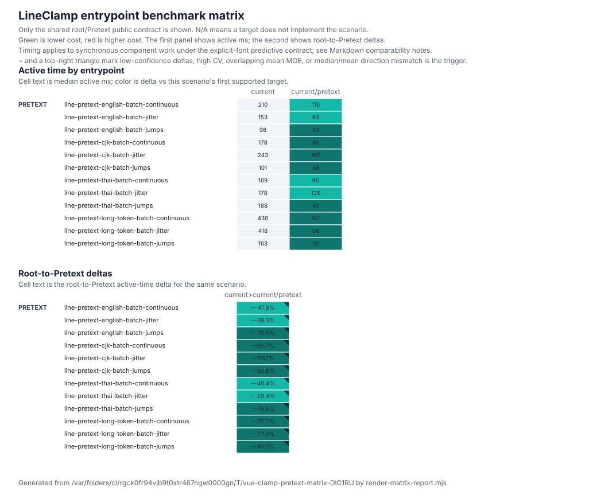

# LineClamp entrypoint benchmark matrix

This report compares the root and opt-in Pretext LineClamp entries on their shared public contract. The primary timing signal is `active ms`; structural counters show the browser work behind each result, and sample CV / RME report active timing variance.

Generated from `/var/folders/cl/rgck0fr94vjb9t0xtr467ngw0000gn/T/vue-clamp-pretext-matrix-DlC1RU`.

This slice measures mounted resize churn after both components have stabilized. Cold text/font preparation and consumer bundle size remain separate delivery signals in `318-pretext-integration-research.md`.

## Target summary

| Target          | Counters | Scenarios | Samples | Sample wall ms | Sample active ms | Median active CV | Max active CV | Median active RME | Max active RME | Active ms | Settled ms | Quiet ms | BBox reads | Client rects | Client rect entries | Resize callbacks | Mutation records | Offset reads | Style reads | Item slot calls | Long tasks |
| --------------- | -------- | --------: | ------: | -------------: | ---------------: | ---------------: | ------------: | ----------------: | -------------: | --------: | ---------: | -------: | ---------: | -----------: | ------------------: | ---------------: | ---------------: | -----------: | ----------: | --------------: | ---------: |
| current         | on       |     12/12 |       5 |         8871.5 |            899.0 |             9.6% |         28.4% |             11.9% |          35.2% |    2529.7 |    16690.4 |  14176.8 |      88057 |            0 |                   0 |            10688 |            91257 |            0 |           0 |               0 |          0 |
| current/pretext | on       |     12/12 |       5 |         8873.4 |            422.0 |            18.3% |         33.4% |             22.7% |          41.5% |     951.7 |    16687.7 |  15732.8 |          0 |            0 |                   0 |              668 |            43778 |            0 |           0 |               0 |          0 |

## Width profile matrix

This describes the executed width input shape for each scenario. Width assignments count every write, including writes inside a burst; steps count the stable waits that are measured.

| Component | Scenario                                 | Steps | Width assignments | Unique widths | Repeated assignments | Repeated transitions | Large deltas (>32px) | Max delta |
| --------- | ---------------------------------------- | ----: | ----------------: | ------------: | -------------------: | -------------------: | -------------------: | --------: |
| LineClamp | line-pretext-english-batch-continuous    |    70 |                71 |            36 |                   35 |                   35 |                    0 |         8 |
| LineClamp | line-pretext-english-batch-jitter        |    70 |                71 |            53 |                   18 |                   18 |                    0 |        19 |
| LineClamp | line-pretext-english-batch-jumps         |    27 |                28 |             7 |                   21 |                   21 |                   24 |       290 |
| LineClamp | line-pretext-cjk-batch-continuous        |    70 |                71 |            36 |                   35 |                   35 |                    0 |         8 |
| LineClamp | line-pretext-cjk-batch-jitter            |    70 |                71 |            53 |                   18 |                   18 |                    0 |        19 |
| LineClamp | line-pretext-cjk-batch-jumps             |    27 |                28 |             7 |                   21 |                   21 |                   24 |       290 |
| LineClamp | line-pretext-thai-batch-continuous       |    70 |                71 |            36 |                   35 |                   35 |                    0 |         8 |
| LineClamp | line-pretext-thai-batch-jitter           |    70 |                71 |            53 |                   18 |                   18 |                    0 |        19 |
| LineClamp | line-pretext-thai-batch-jumps            |    27 |                28 |             7 |                   21 |                   21 |                   24 |       290 |
| LineClamp | line-pretext-long-token-batch-continuous |    70 |                71 |            36 |                   35 |                   35 |                    0 |         8 |
| LineClamp | line-pretext-long-token-batch-jitter     |    70 |                71 |            53 |                   18 |                   18 |                    0 |        19 |
| LineClamp | line-pretext-long-token-batch-jumps      |    27 |                28 |             7 |                   21 |                   21 |                   24 |       290 |

## Top low-noise active hotspots by target

Rows are sorted by median active time and limited to active RME <= 5.0%. Structural columns are `N/A` when counter tracking was disabled for that target.

### current

| Component | Scenario                                 | Active ms | Active RME | Samples | BBox reads | Client rect entries | Mutation records | Offset reads | Style reads |
| --------- | ---------------------------------------- | --------: | ---------: | ------: | ---------: | ------------------: | ---------------: | -----------: | ----------: |
| LineClamp | line-pretext-long-token-batch-continuous |     430.2 |       2.8% |       5 |      15904 |                   0 |            17600 |            0 |           0 |
| LineClamp | line-pretext-long-token-batch-jitter     |     417.9 |       4.0% |       5 |      15936 |                   0 |            17792 |            0 |           0 |
| LineClamp | line-pretext-thai-batch-jumps            |     188.2 |       4.4% |       5 |       4688 |                   0 |             5136 |            0 |           0 |
| LineClamp | line-pretext-long-token-batch-jumps      |     163.4 |       2.1% |       5 |       6176 |                   0 |             6896 |            0 |           0 |

## Top low-noise active hotspots by component

Each component list keeps up to 5 rows with active RME <= 5.0%, sorted by median active time.

### current

#### LineClamp

| Scenario                                 | Active ms | Active RME | Samples | BBox reads | Client rect entries | Mutation records | Offset reads | Style reads |
| ---------------------------------------- | --------: | ---------: | ------: | ---------: | ------------------: | ---------------: | -----------: | ----------: |
| line-pretext-long-token-batch-continuous |     430.2 |       2.8% |       5 |      15904 |                   0 |            17600 |            0 |           0 |
| line-pretext-long-token-batch-jitter     |     417.9 |       4.0% |       5 |      15936 |                   0 |            17792 |            0 |           0 |
| line-pretext-thai-batch-jumps            |     188.2 |       4.4% |       5 |       4688 |                   0 |             5136 |            0 |           0 |
| line-pretext-long-token-batch-jumps      |     163.4 |       2.1% |       5 |       6176 |                   0 |             6896 |            0 |           0 |

## Top structural hotspots by target

### current

| Component | Scenario                                 | Counter                         | Value | Active ms | Active RME |
| --------- | ---------------------------------------- | ------------------------------- | ----: | --------: | ---------: |
| LineClamp | line-pretext-long-token-batch-jitter     | Mutation records                | 17792 |     417.9 |       4.0% |
| LineClamp | line-pretext-long-token-batch-continuous | Mutation records                | 17600 |     430.2 |       2.8% |
| LineClamp | line-pretext-long-token-batch-jitter     | BBox reads                      | 15936 |     417.9 |       4.0% |
| LineClamp | line-pretext-long-token-batch-continuous | BBox reads                      | 15904 |     430.2 |       2.8% |
| LineClamp | line-pretext-long-token-batch-jitter     | Character-data mutation records | 13376 |     417.9 |       4.0% |
| LineClamp | line-pretext-long-token-batch-continuous | Character-data mutation records | 13136 |     430.2 |       2.8% |
| LineClamp | line-pretext-cjk-batch-jitter            | Mutation records                |  7744 |     243.1 |      10.8% |
| LineClamp | line-pretext-cjk-batch-jitter            | BBox reads                      |  7712 |     243.1 |      10.8% |
| LineClamp | line-pretext-english-batch-jitter        | BBox reads                      |  7360 |     153.0 |      26.3% |
| LineClamp | line-pretext-long-token-batch-jumps      | Mutation records                |  6896 |     163.4 |       2.1% |
| LineClamp | line-pretext-english-batch-jitter        | Mutation records                |  6720 |     153.0 |      26.3% |
| LineClamp | line-pretext-long-token-batch-jumps      | BBox reads                      |  6176 |     163.4 |       2.1% |

### current/pretext

| Component | Scenario                                 | Counter                    | Value | Active ms | Active RME |
| --------- | ---------------------------------------- | -------------------------- | ----: | --------: | ---------: |
| LineClamp | line-pretext-long-token-batch-continuous | Mutation records           |  5600 |     106.7 |      14.3% |
| LineClamp | line-pretext-long-token-batch-jitter     | Mutation records           |  5504 |      96.2 |      17.1% |
| LineClamp | line-pretext-cjk-batch-jitter            | Mutation records           |  4816 |     106.7 |      19.4% |
| LineClamp | line-pretext-english-batch-jitter        | Mutation records           |  4576 |      92.9 |      41.5% |
| LineClamp | line-pretext-english-batch-continuous    | Mutation records           |  3872 |     109.7 |       5.5% |
| LineClamp | line-pretext-cjk-batch-continuous        | Mutation records           |  3808 |      86.0 |      16.0% |
| LineClamp | line-pretext-thai-batch-continuous       | Mutation records           |  3680 |      90.4 |      37.4% |
| LineClamp | line-pretext-thai-batch-jitter           | Mutation records           |  3618 |     125.8 |      25.3% |
| LineClamp | line-pretext-english-batch-continuous    | Attribute mutation records |  3360 |     109.7 |       5.5% |
| LineClamp | line-pretext-english-batch-jitter        | Attribute mutation records |  3360 |      92.9 |      41.5% |
| LineClamp | line-pretext-cjk-batch-continuous        | Attribute mutation records |  3360 |      86.0 |      16.0% |
| LineClamp | line-pretext-cjk-batch-jitter            | Attribute mutation records |  3360 |     106.7 |      19.4% |

## Top structural hotspots by component

Each component list keeps up to 5 counter/scenario pairs, sorted by absolute counter value. This section is omitted when counter tracking is disabled.

### current

#### LineClamp

| Scenario                                 | Counter                         | Value | Active ms | Active RME |
| ---------------------------------------- | ------------------------------- | ----: | --------: | ---------: |
| line-pretext-long-token-batch-jitter     | Mutation records                | 17792 |     417.9 |       4.0% |
| line-pretext-long-token-batch-continuous | Mutation records                | 17600 |     430.2 |       2.8% |
| line-pretext-long-token-batch-jitter     | BBox reads                      | 15936 |     417.9 |       4.0% |
| line-pretext-long-token-batch-continuous | BBox reads                      | 15904 |     430.2 |       2.8% |
| line-pretext-long-token-batch-jitter     | Character-data mutation records | 13376 |     417.9 |       4.0% |

### current/pretext

#### LineClamp

| Scenario                                 | Counter          | Value | Active ms | Active RME |
| ---------------------------------------- | ---------------- | ----: | --------: | ---------: |
| line-pretext-long-token-batch-continuous | Mutation records |  5600 |     106.7 |      14.3% |
| line-pretext-long-token-batch-jitter     | Mutation records |  5504 |      96.2 |      17.1% |
| line-pretext-cjk-batch-jitter            | Mutation records |  4816 |     106.7 |      19.4% |
| line-pretext-english-batch-jitter        | Mutation records |  4576 |      92.9 |      41.5% |
| line-pretext-english-batch-continuous    | Mutation records |  3872 |     109.7 |       5.5% |

## Entrypoint comparison summary

| From    | To              | Comparable scenarios | Low-conf active rows | Active delta |       Active ms | BBox delta | Client rect delta | Client rect entry delta | Resize callback delta | Mutation delta | Offset delta | Style delta | Slot delta | Settled delta | Long task delta |
| ------- | --------------- | -------------------: | -------------------: | -----------: | --------------: | ---------: | ----------------: | ----------------------: | --------------------: | -------------: | -----------: | ----------: | ---------: | ------------: | --------------: |
| current | current/pretext |                12/12 |                12/12 |      ~-62.4% | 2529.7 -> 951.7 |    -100.0% |               N/A |                     N/A |                -93.8% |         -52.0% |          N/A |         N/A |        N/A |         -0.0% |             N/A |

## Active time matrix

| Component | Scenario                                 | current | current/pretext |
| --------- | ---------------------------------------- | ------: | --------------: |
| LineClamp | line-pretext-english-batch-continuous    |   210.4 |           109.7 |
| LineClamp | line-pretext-english-batch-jitter        |   153.0 |            92.9 |
| LineClamp | line-pretext-english-batch-jumps         |    98.0 |            28.8 |
| LineClamp | line-pretext-cjk-batch-continuous        |   177.9 |            86.0 |
| LineClamp | line-pretext-cjk-batch-jitter            |   243.1 |           106.7 |
| LineClamp | line-pretext-cjk-batch-jumps             |   100.7 |            37.7 |
| LineClamp | line-pretext-thai-batch-continuous       |   168.6 |            90.4 |
| LineClamp | line-pretext-thai-batch-jitter           |   178.3 |           125.8 |
| LineClamp | line-pretext-thai-batch-jumps            |   188.2 |            39.7 |
| LineClamp | line-pretext-long-token-batch-continuous |   430.2 |           106.7 |
| LineClamp | line-pretext-long-token-batch-jitter     |   417.9 |            96.2 |
| LineClamp | line-pretext-long-token-batch-jumps      |   163.4 |            31.1 |

## Entrypoint active delta matrix

| Component | Scenario                                 | current -> current/pretext |
| --------- | ---------------------------------------- | -------------------------: |
| LineClamp | line-pretext-english-batch-continuous    |                    ~-47.9% |
| LineClamp | line-pretext-english-batch-jitter        |                    ~-39.3% |
| LineClamp | line-pretext-english-batch-jumps         |                    ~-70.6% |
| LineClamp | line-pretext-cjk-batch-continuous        |                    ~-51.7% |
| LineClamp | line-pretext-cjk-batch-jitter            |                    ~-56.1% |
| LineClamp | line-pretext-cjk-batch-jumps             |                    ~-62.6% |
| LineClamp | line-pretext-thai-batch-continuous       |                    ~-46.4% |
| LineClamp | line-pretext-thai-batch-jitter           |                    ~-29.4% |
| LineClamp | line-pretext-thai-batch-jumps            |                    ~-78.9% |
| LineClamp | line-pretext-long-token-batch-continuous |                    ~-75.2% |
| LineClamp | line-pretext-long-token-batch-jitter     |                    ~-77.0% |
| LineClamp | line-pretext-long-token-batch-jumps      |                    ~-81.0% |

## Correctness and comparability notes

The entrypoints are comparable only on the Pretext contract represented here: plain text, an explicit canvas font shorthand, maxLines, end truncation, word boundaries with grapheme fallback, and the default ellipsis. The result does not generalize to the root entry's broader layout-authoritative API.

## Top movers by entrypoint

### current -> current/pretext

| Component | Scenario                                 | Active delta |      Active ms |     Active RME | Confidence                | BBox delta | Client rect delta | Client rect entry delta | Mutation delta | Offset delta | Slot delta | Settled delta |
| --------- | ---------------------------------------- | -----------: | -------------: | -------------: | ------------------------- | ---------: | ----------------: | ----------------------: | -------------: | -----------: | ---------: | ------------: |
| LineClamp | line-pretext-long-token-batch-jumps      |      ~-81.0% |  163.4 -> 31.1 |  2.1% -> 25.3% | low (high active-time CV) |    -100.0% |               N/A |                     N/A |         -68.7% |          N/A |        N/A |         -0.1% |
| LineClamp | line-pretext-thai-batch-jumps            |      ~-78.9% |  188.2 -> 39.7 |  4.4% -> 20.1% | low (high active-time CV) |    -100.0% |               N/A |                     N/A |         -60.1% |          N/A |        N/A |         +0.0% |
| LineClamp | line-pretext-long-token-batch-jitter     |      ~-77.0% |  417.9 -> 96.2 |  4.0% -> 17.1% | low (high active-time CV) |    -100.0% |               N/A |                     N/A |         -69.1% |          N/A |        N/A |         -0.0% |
| LineClamp | line-pretext-long-token-batch-continuous |      ~-75.2% | 430.2 -> 106.7 |  2.8% -> 14.3% | low (high active-time CV) |    -100.0% |               N/A |                     N/A |         -68.2% |          N/A |        N/A |         -0.0% |
| LineClamp | line-pretext-english-batch-jumps         |      ~-70.6% |   98.0 -> 28.8 | 13.7% -> 40.3% | low (high active-time CV) |    -100.0% |               N/A |                     N/A |         -59.1% |          N/A |        N/A |         +0.0% |
| LineClamp | line-pretext-cjk-batch-jumps             |      ~-62.6% |  100.7 -> 37.7 | 13.2% -> 30.1% | low (high active-time CV) |    -100.0% |               N/A |                     N/A |         -59.6% |          N/A |        N/A |         +0.0% |
| LineClamp | line-pretext-cjk-batch-jitter            |      ~-56.1% | 243.1 -> 106.7 | 10.8% -> 19.4% | low (high active-time CV) |    -100.0% |               N/A |                     N/A |         -37.8% |          N/A |        N/A |         -0.0% |
| LineClamp | line-pretext-cjk-batch-continuous        |      ~-51.7% |  177.9 -> 86.0 | 12.3% -> 16.0% | low (high active-time CV) |    -100.0% |               N/A |                     N/A |         -22.5% |          N/A |        N/A |         +0.1% |

## Top structural movers by entrypoint

### current -> current/pretext

| Component | Scenario                              | Counter                     |   Delta |     Value | Active delta | Active confidence         |
| --------- | ------------------------------------- | --------------------------- | ------: | --------: | -----------: | ------------------------- |
| LineClamp | line-pretext-english-batch-continuous | BBox reads                  | -100.0% | 6080 -> 0 |      ~-47.9% | low (high active-time CV) |
| LineClamp | line-pretext-english-batch-continuous | Child-list mutation records | -100.0% |  288 -> 0 |      ~-47.9% | low (high active-time CV) |
| LineClamp | line-pretext-english-batch-continuous | Added nodes                 | -100.0% |  272 -> 0 |      ~-47.9% | low (high active-time CV) |
| LineClamp | line-pretext-english-batch-continuous | Removed nodes               | -100.0% |  272 -> 0 |      ~-47.9% | low (high active-time CV) |
| LineClamp | line-pretext-english-batch-jitter     | BBox reads                  | -100.0% | 7360 -> 0 |      ~-39.3% | low (high active-time CV) |
| LineClamp | line-pretext-english-batch-jitter     | Child-list mutation records | -100.0% |  608 -> 0 |      ~-39.3% | low (high active-time CV) |
| LineClamp | line-pretext-english-batch-jitter     | Added nodes                 | -100.0% |  608 -> 0 |      ~-39.3% | low (high active-time CV) |
| LineClamp | line-pretext-english-batch-jitter     | Removed nodes               | -100.0% |  608 -> 0 |      ~-39.3% | low (high active-time CV) |
| LineClamp | line-pretext-english-batch-jumps      | BBox reads                  | -100.0% | 4752 -> 0 |      ~-70.6% | low (high active-time CV) |
| LineClamp | line-pretext-english-batch-jumps      | Child-list mutation records | -100.0% |  768 -> 0 |      ~-70.6% | low (high active-time CV) |
| LineClamp | line-pretext-english-batch-jumps      | Added nodes                 | -100.0% |  576 -> 0 |      ~-70.6% | low (high active-time CV) |
| LineClamp | line-pretext-english-batch-jumps      | Removed nodes               | -100.0% |  576 -> 0 |      ~-70.6% | low (high active-time CV) |

## Visualization

The SVG contains two panels: absolute active time by entrypoint and the root-to-Pretext active-time delta.

`~` marks a low-confidence delta: at least one side has active-time CV above 10%, compared active-time mean MOE intervals overlap, or median and mean active-time deltas point in opposite directions. SVG cells keep the normal direction color and add a top-right triangle marker.

