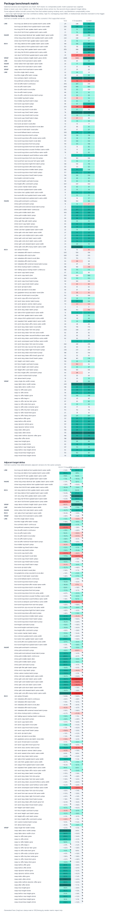

# Package benchmark matrix

Read the [coverage, separate original/new-row summaries, and repeat analysis](330-performance-matrix-refresh.md)
before interpreting aggregate deltas. `1.7.0 baseline` is the pre-research-329 snapshot;
`current` is the final implementation, not another published release.

This report compares the public component benchmark matrix across package versions and snapshots. The primary timing signal is `active ms`; `settled ms` preserves the end-to-end quiet-frame timing, counters explain whether a change came from layout reads, DOM cloning/replacement, or slot rendering, and sample CV / RME report active timing variance.

Generated from `/tmp/vue-clamp-matrix-330/timing`.

The opt-in root/Pretext comparison is maintained as a separate shared-contract slice in [`319-pretext-performance-matrix.md`](319-pretext-performance-matrix.md).

Counter tracking was disabled for 1.6.0, 1.7.0 baseline, current. Active timing remains available, but structural counter summaries and deltas for those columns are rendered as `N/A`.

## Version summary

| Version        | Counters | Scenarios | Samples | Sample wall ms | Sample active ms | Median active CV | Max active CV | Median active RME | Max active RME | Active ms | Settled ms | Quiet ms | BBox reads | Client rects | Client rect entries | Resize callbacks | Mutation records | Offset reads | Style reads | Slot calls | Long tasks |
| -------------- | -------- | --------: | ------: | -------------: | ---------------: | ---------------: | ------------: | ----------------: | -------------: | --------: | ---------: | -------: | ---------: | -----------: | ------------------: | ---------------: | ---------------: | -----------: | ----------: | ---------: | ---------: |
| 1.6.0          | off      |   152/152 |       3 |         1283.1 |            269.2 |             3.3% |         50.8% |              8.3% |         126.3% |   22912.4 |    94555.0 |  71645.2 |        N/A |          N/A |                 N/A |              N/A |              N/A |          N/A |         N/A |        N/A |         29 |
| 1.7.0 baseline | off      |   152/152 |       3 |         1275.1 |            244.8 |             3.7% |         67.1% |              9.3% |         166.6% |   21675.4 |    94455.1 |  72815.1 |        N/A |          N/A |                 N/A |              N/A |              N/A |          N/A |         N/A |        N/A |         20 |
| current        | off      |   152/152 |       3 |         1276.0 |            242.7 |             3.5% |         58.8% |              8.6% |         146.1% |   16210.4 |    89044.5 |  72842.9 |        N/A |          N/A |                 N/A |              N/A |              N/A |          N/A |         N/A |        N/A |         19 |

## Width profile matrix

This describes the executed width input shape for each scenario. Width assignments count every write, including writes inside a burst; steps count the stable waits that are measured.

| Component     | Scenario                                                 | Steps | Width assignments | Unique widths | Repeated assignments | Repeated transitions | Large deltas (>32px) | Max delta |
| ------------- | -------------------------------------------------------- | ----: | ----------------: | ------------: | -------------------: | -------------------: | -------------------: | --------: |
| LineClamp     | line-long-cjk-identical-text-update-batch-same-width     |     6 |                 7 |             1 |                    6 |                    6 |                    0 |         0 |
| LineClamp     | line-long-cjk-distinct-text-update-batch-same-width      |     6 |                 7 |             1 |                    6 |                    6 |                    0 |         0 |
| LineClamp     | line-long-full-fit-text-update-batch-same-width          |     6 |                 7 |             1 |                    6 |                    6 |                    0 |         0 |
| LineClamp     | line-short-full-fit-text-update-batch-same-width         |     6 |                 7 |             1 |                    6 |                    6 |                    0 |         0 |
| InlineClamp   | inline-long-emoji-identical-text-update-batch-same-width |     6 |                 7 |             1 |                    6 |                    6 |                    0 |         0 |
| InlineClamp   | inline-long-emoji-distinct-text-update-batch-same-width  |     6 |                 7 |             1 |                    6 |                    6 |                    0 |         0 |
| InlineClamp   | inline-short-full-fit-text-update-batch-same-width       |     6 |                 7 |             1 |                    6 |                    6 |                    0 |         0 |
| RichLineClamp | rich-long-identical-html-update-batch-same-width         |     6 |                 7 |             1 |                    6 |                    6 |                    0 |         0 |
| RichLineClamp | rich-long-distinct-html-update-batch-same-width          |     6 |                 7 |             1 |                    6 |                    6 |                    0 |         0 |
| RichLineClamp | rich-very-long-html-update-batch-same-width              |     6 |                 7 |             1 |                    6 |                    6 |                    0 |         0 |
| RichLineClamp | rich-long-full-fit-html-update-batch-same-width          |     6 |                 7 |             1 |                    6 |                    6 |                    0 |         0 |
| RichLineClamp | rich-short-full-fit-html-update-batch-same-width         |     6 |                 7 |             1 |                    6 |                    6 |                    0 |         0 |
| WrapClamp     | wrap-dense-markers-height-batch-grow-shrink              |     6 |                 7 |             5 |                    2 |                    2 |                    6 |      1936 |
| LineClamp     | line-native-font-load-batch-same-width                   |     6 |                 7 |             1 |                    6 |                    6 |                    0 |         0 |
| InlineClamp   | inline-native-font-load-batch-same-width                 |     6 |                 7 |             1 |                    6 |                    6 |                    0 |         0 |
| RichLineClamp | rich-native-font-load-batch-same-width                   |     6 |                 7 |             1 |                    6 |                    6 |                    0 |         0 |
| WrapClamp     | wrap-native-font-load-batch-same-width                   |     6 |                 7 |             1 |                    6 |                    6 |                    0 |         0 |
| LineClamp     | line-title-single-batch-sweep                            |    16 |                17 |             9 |                    8 |                    8 |                    0 |        20 |
| LineClamp     | line-title-single-affix-batch-sweep                      |    16 |                17 |             9 |                    8 |                    8 |                    0 |        20 |
| LineClamp     | line-summary-batch-continuous                            |    70 |                71 |            36 |                   35 |                   35 |                    0 |         8 |
| LineClamp     | line-prefixed-summary-batch-jumps                        |    20 |                21 |             6 |                   15 |                   15 |                   18 |       280 |
| LineClamp     | line-cta-affix-batch-continuous                          |   140 |               141 |            71 |                   70 |                   70 |                    0 |         4 |
| LineClamp     | line-cta-affix-batch-jitter                              |   140 |               141 |            80 |                   61 |                   61 |                    0 |        19 |
| LineClamp     | line-cta-affix-batch-novel-jitter                        |    34 |                35 |            35 |                    0 |                    0 |                   22 |        78 |
| LineClamp     | line-cta-affix-batch-jumps                               |    27 |                28 |             6 |                   22 |                   22 |                   24 |       300 |
| LineClamp     | line-cta-affix-external-resize-batch-jumps               |    20 |                21 |             6 |                   15 |                   15 |                   18 |       280 |
| LineClamp     | line-middle-log-batch-jumps                              |    20 |                21 |             6 |                   15 |                   15 |                   18 |       280 |
| LineClamp     | line-middle-log-lines5-batch-steps                       |    29 |                30 |             8 |                   22 |                   22 |                    0 |        20 |
| LineClamp     | line-word-copy-batch-jumps                               |    20 |                21 |             6 |                   15 |                   15 |                   18 |       280 |
| LineClamp     | line-word-copy-batch-jitter                              |   120 |               121 |            76 |                   45 |                   45 |                    0 |        17 |
| LineClamp     | line-word-copy-batch-novel-jitter                        |    34 |                35 |            35 |                    0 |                    0 |                   14 |        78 |
| LineClamp     | line-word-copy-lines1-batch-jumps                        |    20 |                21 |             6 |                   15 |                   15 |                   18 |       280 |
| LineClamp     | line-word-copy-lines5-batch-jumps                        |    20 |                21 |             6 |                   15 |                   15 |                   18 |       280 |
| LineClamp     | line-word-copy-lines5-batch-steps                        |    29 |                30 |             8 |                   22 |                   22 |                    0 |        20 |
| LineClamp     | line-word-cjk-batch-jitter                               |    28 |                29 |            29 |                    0 |                    0 |                   11 |        38 |
| LineClamp     | line-word-cjk-batch-novel-jitter                         |    34 |                35 |            35 |                    0 |                    0 |                   20 |        79 |
| LineClamp     | line-grapheme-emoji-zwj-batch-novel-jitter               |    34 |                35 |            35 |                    0 |                    0 |                   13 |        67 |
| LineClamp     | line-word-rtl-bidi-batch-novel-jitter                    |    34 |                35 |            35 |                    0 |                    0 |                   17 |        71 |
| LineClamp     | line-word-fallback-batch-continuous                      |    64 |                65 |            65 |                    0 |                    0 |                    0 |         8 |
| LineClamp     | line-word-long-token-batch-jumps                         |    34 |                35 |             6 |                   29 |                   29 |                   30 |       120 |
| LineClamp     | line-word-long-token-affix-resize-same-width             |     6 |                 7 |             1 |                    6 |                    6 |                    0 |         0 |
| LineClamp     | line-word-long-token-batch-novel-jitter                  |    34 |                35 |            35 |                    0 |                    0 |                   18 |        81 |
| LineClamp     | line-word-long-token-font-tick-jumps                     |    34 |                35 |             6 |                   29 |                   29 |                   30 |       120 |
| LineClamp     | line-word-long-token-font-tick-same-width                |     6 |                 7 |             1 |                    6 |                    6 |                    0 |         0 |
| LineClamp     | line-word-long-token-unused-fontface-same-width          |     6 |                 7 |             1 |                    6 |                    6 |                    0 |         0 |
| LineClamp     | line-word-long-token-used-fontface-same-width            |     6 |                 7 |             1 |                    6 |                    6 |                    0 |         0 |
| LineClamp     | line-word-unclamped-used-fontface-same-width             |     6 |                 7 |             1 |                    6 |                    6 |                    0 |         0 |
| LineClamp     | line-word-long-token-font-size-tick-jumps                |    34 |                35 |             6 |                   29 |                   29 |                   30 |       120 |
| LineClamp     | line-word-font-size-recover-full-same-width              |     6 |                 7 |             1 |                    6 |                    6 |                    0 |         0 |
| LineClamp     | line-word-long-token-tight-font-batch-jumps              |    34 |                35 |             6 |                   29 |                   29 |                   30 |       120 |
| LineClamp     | line-word-long-token-affix-batch-jumps                   |    34 |                35 |             6 |                   29 |                   29 |                   30 |       120 |
| LineClamp     | line-word-long-token-middle-batch-jumps                  |    34 |                35 |             6 |                   29 |                   29 |                   30 |       120 |
| LineClamp     | line-word-long-token-lines1-batch-jumps                  |    34 |                35 |             6 |                   29 |                   29 |                   30 |       120 |
| LineClamp     | line-word-long-token-lines5-batch-jumps                  |    34 |                35 |             6 |                   29 |                   29 |                   30 |       120 |
| LineClamp     | line-height-card-batch-jumps                             |    20 |                21 |             6 |                   15 |                   15 |                   18 |       280 |
| LineClamp     | line-word-height-card-batch-jumps                        |    20 |                21 |             6 |                   15 |                   15 |                   18 |       280 |
| LineClamp     | line-height-affix-card-batch-jumps                       |    77 |                78 |            21 |                   57 |                   57 |                   43 |       520 |
| LineClamp     | line-custom-marker-batch-jumps                           |    20 |                21 |             6 |                   15 |                   15 |                   18 |       280 |
| LineClamp     | line-cold-text-update-batch-same-width                   |     6 |                 7 |             1 |                    6 |                    6 |                    0 |         0 |
| LineClamp     | line-native-text-update-batch-same-width                 |     6 |                 7 |             1 |                    6 |                    6 |                    0 |         0 |
| LineClamp     | line-word-affix-text-update-batch-same-width             |     6 |                 7 |             1 |                    6 |                    6 |                    0 |         0 |
| LineClamp     | line-word-height-text-update-batch-same-width            |     6 |                 7 |             1 |                    6 |                    6 |                    0 |         0 |
| InlineClamp   | inline-path-end-batch-continuous                         |   114 |               115 |           115 |                    0 |                    0 |                    0 |         4 |
| InlineClamp   | inline-path-end-batch-jumps                              |    20 |                21 |             6 |                   15 |                   15 |                   18 |       240 |
| InlineClamp   | inline-path-end-external-resize-batch-jumps              |    20 |                21 |             6 |                   15 |                   15 |                   18 |       240 |
| InlineClamp   | inline-path-middle-batch-continuous                      |   114 |               115 |           115 |                    0 |                    0 |                    0 |         4 |
| InlineClamp   | inline-path-middle-batch-jitter                          |   120 |               121 |            53 |                   68 |                   68 |                    0 |        13 |
| InlineClamp   | inline-path-middle-batch-jumps                           |    20 |                21 |             6 |                   15 |                   15 |                   18 |       240 |
| InlineClamp   | inline-path-start-batch-jumps                            |    20 |                21 |             6 |                   15 |                   15 |                   18 |       240 |
| InlineClamp   | inline-split-file-path-batch-jumps                       |    20 |                21 |             6 |                   15 |                   15 |                   18 |       240 |
| InlineClamp   | inline-word-copy-batch-jumps                             |    20 |                21 |             6 |                   15 |                   15 |                   18 |       240 |
| InlineClamp   | inline-custom-marker-batch-jumps                         |    20 |                21 |             6 |                   15 |                   15 |                   18 |       240 |
| InlineClamp   | inline-cold-text-update-batch-same-width                 |     6 |                 7 |             1 |                    6 |                    6 |                    0 |         0 |
| InlineClamp   | inline-split-cold-start-batch-same-width                 |     6 |                 7 |             1 |                    6 |                    6 |                    0 |         0 |
| InlineClamp   | inline-split-cold-middle-batch-same-width                |     6 |                 7 |             1 |                    6 |                    6 |                    0 |         0 |
| InlineClamp   | inline-split-cold-end-batch-same-width                   |     6 |                 7 |             1 |                    6 |                    6 |                    0 |         0 |
| InlineClamp   | inline-split-cold-short-batch-same-width                 |     6 |                 7 |             1 |                    6 |                    6 |                    0 |         0 |
| InlineClamp   | inline-split-cold-skewed-batch-same-width                |     6 |                 7 |             1 |                    6 |                    6 |                    0 |         0 |
| InlineClamp   | inline-split-cold-affix-heavy-batch-same-width           |     6 |                 7 |             1 |                    6 |                    6 |                    0 |         0 |
| RichLineClamp | rich-article-fit-batch                                   |     8 |                 9 |             5 |                    4 |                    4 |                    8 |        40 |
| RichLineClamp | rich-metadata-affix-batch-continuous                     |   110 |               111 |            56 |                   55 |                   55 |                    0 |         4 |
| RichLineClamp | rich-metadata-affix-batch-jitter                         |   120 |               121 |            82 |                   39 |                   39 |                    0 |        21 |
| RichLineClamp | rich-metadata-affix-batch-novel-jitter                   |    34 |                35 |            35 |                    0 |                    0 |                   20 |        70 |
| RichLineClamp | rich-metadata-affix-batch-jumps                          |    20 |                21 |             6 |                   15 |                   15 |                   18 |       260 |
| RichLineClamp | rich-metadata-affix-external-resize-batch-jumps          |    20 |                21 |             6 |                   15 |                   15 |                   18 |       260 |
| RichLineClamp | rich-inline-markup-batch-continuous                      |   110 |               111 |            56 |                   55 |                   55 |                    0 |         4 |
| RichLineClamp | rich-trailing-space-markup-batch-continuous              |   110 |               111 |            56 |                   55 |                   55 |                    0 |         4 |
| RichLineClamp | rich-word-copy-batch-jumps                               |    20 |                21 |             6 |                   15 |                   15 |                   18 |       260 |
| RichLineClamp | rich-word-copy-batch-jitter                              |   120 |               121 |            72 |                   49 |                   49 |                    0 |        19 |
| RichLineClamp | rich-word-copy-batch-novel-jitter                        |    34 |                35 |            35 |                    0 |                    0 |                   19 |        70 |
| RichLineClamp | rich-word-copy-lines1-batch-jumps                        |    20 |                21 |             6 |                   15 |                   15 |                   18 |       260 |
| RichLineClamp | rich-word-copy-lines5-batch-jumps                        |    20 |                21 |             6 |                   15 |                   15 |                   18 |       260 |
| RichLineClamp | rich-word-cjk-batch-jitter                               |    24 |                25 |            25 |                    0 |                    0 |                    7 |        35 |
| RichLineClamp | rich-word-cjk-batch-novel-jitter                         |    34 |                35 |            35 |                    0 |                    0 |                   19 |        71 |
| RichLineClamp | rich-grapheme-emoji-zwj-batch-novel-jitter               |    34 |                35 |            35 |                    0 |                    0 |                   16 |        72 |
| RichLineClamp | rich-word-rtl-bidi-batch-novel-jitter                    |    34 |                35 |            35 |                    0 |                    0 |                   22 |        69 |
| RichLineClamp | rich-word-copy-affix-lines1-grow-full                    |     6 |                 7 |             3 |                    4 |                    4 |                    6 |       780 |
| RichLineClamp | rich-word-class-atomic-batch-jumps                       |    34 |                35 |             5 |                   30 |                   30 |                   30 |        52 |
| RichLineClamp | rich-word-dynamic-atomic-batch-jumps                     |    34 |                35 |             5 |                   30 |                   30 |                   30 |        64 |
| RichLineClamp | rich-word-nested-inline-metric-same-width                |     6 |                 7 |             1 |                    6 |                    6 |                    0 |         0 |
| RichLineClamp | rich-word-long-token-batch-jumps                         |    34 |                35 |             6 |                   29 |                   29 |                   30 |       120 |
| RichLineClamp | rich-native-html-update-batch-same-width                 |     6 |                 7 |             1 |                    6 |                    6 |                    0 |         0 |
| RichLineClamp | rich-cold-html-update-batch-same-width                   |     6 |                 7 |             1 |                    6 |                    6 |                    0 |         0 |
| RichLineClamp | rich-unique-html-update-batch-same-width                 |     6 |                 7 |             1 |                    6 |                    6 |                    0 |         0 |
| RichLineClamp | rich-repeated-html-update-batch-same-width               |     6 |                 7 |             1 |                    6 |                    6 |                    0 |         0 |
| RichLineClamp | rich-word-long-token-affix-resize-same-width             |     6 |                 7 |             1 |                    6 |                    6 |                    0 |         0 |
| RichLineClamp | rich-word-long-token-batch-novel-jitter                  |    34 |                35 |            35 |                    0 |                    0 |                   19 |        77 |
| RichLineClamp | rich-word-long-token-font-tick-jumps                     |    34 |                35 |             6 |                   29 |                   29 |                   30 |       120 |
| RichLineClamp | rich-word-long-token-font-tick-same-width                |     6 |                 7 |             1 |                    6 |                    6 |                    0 |         0 |
| RichLineClamp | rich-word-long-token-unused-fontface-same-width          |     6 |                 7 |             1 |                    6 |                    6 |                    0 |         0 |
| RichLineClamp | rich-word-long-token-used-fontface-same-width            |     6 |                 7 |             1 |                    6 |                    6 |                    0 |         0 |
| RichLineClamp | rich-word-unclamped-used-fontface-same-width             |     6 |                 7 |             1 |                    6 |                    6 |                    0 |         0 |
| RichLineClamp | rich-word-long-token-font-size-tick-jumps                |    34 |                35 |             6 |                   29 |                   29 |                   30 |       120 |
| RichLineClamp | rich-word-font-size-recover-full-same-width              |     6 |                 7 |             1 |                    6 |                    6 |                    0 |         0 |
| RichLineClamp | rich-word-long-token-tight-font-batch-jumps              |    34 |                35 |             6 |                   29 |                   29 |                   30 |       120 |
| RichLineClamp | rich-word-long-token-lines1-batch-jumps                  |    34 |                35 |             6 |                   29 |                   29 |                   30 |       120 |
| RichLineClamp | rich-word-long-token-affix-lines5-grow-full              |     6 |                 7 |             3 |                    4 |                    4 |                    6 |       780 |
| RichLineClamp | rich-word-long-token-lines5-batch-jumps                  |    34 |                35 |             6 |                   29 |                   29 |                   30 |       120 |
| RichLineClamp | rich-height-card-batch-jumps                             |    20 |                21 |             6 |                   15 |                   15 |                   18 |       260 |
| RichLineClamp | rich-lines-height-card-batch-jumps                       |    20 |                21 |             6 |                   15 |                   15 |                   18 |       260 |
| RichLineClamp | rich-word-height-card-batch-jumps                        |    20 |                21 |             6 |                   15 |                   15 |                   18 |       260 |
| RichLineClamp | rich-height-affix-card-batch-jumps                       |    20 |                21 |             6 |                   15 |                   15 |                   18 |       260 |
| RichLineClamp | rich-lines-height-affix-card-batch-jumps                 |    20 |                21 |             6 |                   15 |                   15 |                   18 |       260 |
| RichLineClamp | rich-custom-marker-batch-jumps                           |    20 |                21 |             6 |                   15 |                   15 |                   18 |       260 |
| RichLineClamp | rich-dense-batch-jumps                                   |     6 |                 7 |             4 |                    3 |                    3 |                    6 |        40 |
| WrapClamp     | wrap-single-line-width-sweep                             |    16 |                17 |             9 |                    8 |                    8 |                    0 |        20 |
| WrapClamp     | wrap-table-demo-width-sweep                              |     8 |                 9 |             5 |                    4 |                    4 |                    8 |        40 |
| WrapClamp     | wrap-table-demo-width-churn                              |     4 |                17 |             5 |                   12 |                   12 |                   16 |        40 |
| WrapClamp     | wrap-no-affix-jump-grow                                  |     6 |                 7 |             2 |                    5 |                    5 |                    6 |       160 |
| WrapClamp     | wrap-no-affix-shrink                                     |     4 |                 5 |             5 |                    0 |                    0 |                    2 |       120 |
| WrapClamp     | wrap-no-affix-hidden-grow                                |     5 |                 6 |             2 |                    4 |                    4 |                    5 |       400 |
| WrapClamp     | wrap-no-affix-large-n                                    |     3 |                 4 |             2 |                    2 |                    2 |                    3 |       400 |
| WrapClamp     | wrap-no-affix-narrow-item-grow                           |     3 |                 4 |             2 |                    2 |                    2 |                    3 |       400 |
| WrapClamp     | wrap-no-affix-wide-item-grow                             |     3 |                 4 |             2 |                    2 |                    2 |                    3 |       360 |
| WrapClamp     | wrap-no-affix-wide-container-grow                        |     3 |                 4 |             2 |                    2 |                    2 |                    3 |       640 |
| WrapClamp     | wrap-no-affix-tiny-item-wide-grow                        |     3 |                 4 |             2 |                    2 |                    2 |                    3 |       840 |
| WrapClamp     | wrap-no-affix-mixed-item-grow                            |     3 |                 4 |             2 |                    2 |                    2 |                    3 |       560 |
| WrapClamp     | wrap-no-affix-heavy-item-grow                            |     5 |                 6 |             2 |                    4 |                    4 |                    5 |       400 |
| WrapClamp     | wrap-before-affix-grow                                   |     3 |                 4 |             2 |                    2 |                    2 |                    3 |       400 |
| WrapClamp     | wrap-before-affix-shrink                                 |     4 |                 5 |             5 |                    0 |                    0 |                    4 |       160 |
| WrapClamp     | wrap-dynamic-before-grow                                 |     3 |                 4 |             2 |                    2 |                    2 |                    3 |       400 |
| WrapClamp     | wrap-dynamic-before-shrink                               |     4 |                 5 |             5 |                    0 |                    0 |                    4 |       160 |
| WrapClamp     | wrap-static-after-grow                                   |     3 |                 4 |             2 |                    2 |                    2 |                    3 |       400 |
| WrapClamp     | wrap-static-after-shrink                                 |     4 |                 5 |             5 |                    0 |                    0 |                    4 |       160 |
| WrapClamp     | wrap-static-before-dynamic-after-grow                    |     3 |                 4 |             2 |                    2 |                    2 |                    3 |       400 |
| WrapClamp     | wrap-after-affix-shrink                                  |     4 |                 5 |             5 |                    0 |                    0 |                    4 |       160 |
| WrapClamp     | wrap-max-height-grow                                     |     3 |                 4 |             2 |                    2 |                    2 |                    3 |       400 |
| WrapClamp     | wrap-max-height-shrink                                   |     4 |                 5 |             5 |                    0 |                    0 |                    4 |       160 |
| WrapClamp     | wrap-before-max-height-grow                              |     3 |                 4 |             2 |                    2 |                    2 |                    3 |       400 |
| WrapClamp     | wrap-before-max-height-shrink                            |     4 |                 5 |             5 |                    0 |                    0 |                    4 |       160 |
| WrapClamp     | wrap-mixed-lines-height-grow                             |     3 |                 4 |             2 |                    2 |                    2 |                    3 |       400 |
| WrapClamp     | wrap-mixed-lines-height-shrink                           |     4 |                 5 |             5 |                    0 |                    0 |                    4 |       160 |

## Top low-noise active hotspots by version

Rows are sorted by median active time and limited to active RME <= 5.0%. Structural columns are `N/A` when counter tracking was disabled for that version.

### 1.6.0

| Component     | Scenario                                                 | Active ms | Active RME | Samples | BBox reads | Client rect entries | Mutation records | Offset reads | Style reads |
| ------------- | -------------------------------------------------------- | --------: | ---------: | ------: | ---------: | ------------------: | ---------------: | -----------: | ----------: |
| WrapClamp     | wrap-dense-markers-height-batch-grow-shrink              |    4386.1 |       4.8% |       3 |        N/A |                 N/A |              N/A |          N/A |         N/A |
| RichLineClamp | rich-very-long-html-update-batch-same-width              |     858.1 |       4.6% |       3 |        N/A |                 N/A |              N/A |          N/A |         N/A |
| LineClamp     | line-cta-affix-batch-jitter                              |     649.1 |       3.3% |       3 |        N/A |                 N/A |              N/A |          N/A |         N/A |
| RichLineClamp | rich-metadata-affix-batch-jitter                         |     590.1 |       1.8% |       3 |        N/A |                 N/A |              N/A |          N/A |         N/A |
| InlineClamp   | inline-path-middle-batch-continuous                      |     433.4 |       4.2% |       3 |        N/A |                 N/A |              N/A |          N/A |         N/A |
| LineClamp     | line-word-fallback-batch-continuous                      |     390.1 |       2.8% |       3 |        N/A |                 N/A |              N/A |          N/A |         N/A |
| LineClamp     | line-long-cjk-distinct-text-update-batch-same-width      |     284.3 |       2.9% |       3 |        N/A |                 N/A |              N/A |          N/A |         N/A |
| RichLineClamp | rich-word-long-token-font-size-tick-jumps                |     282.0 |       2.7% |       3 |        N/A |                 N/A |              N/A |          N/A |         N/A |
| RichLineClamp | rich-word-long-token-font-tick-jumps                     |     242.5 |       1.9% |       3 |        N/A |                 N/A |              N/A |          N/A |         N/A |
| WrapClamp     | wrap-table-demo-width-sweep                              |     240.1 |       2.1% |       3 |        N/A |                 N/A |              N/A |          N/A |         N/A |
| InlineClamp   | inline-long-emoji-distinct-text-update-batch-same-width  |     232.6 |       4.5% |       3 |        N/A |                 N/A |              N/A |          N/A |         N/A |
| InlineClamp   | inline-long-emoji-identical-text-update-batch-same-width |     230.2 |       0.4% |       3 |        N/A |                 N/A |              N/A |          N/A |         N/A |

### 1.7.0 baseline

| Component     | Scenario                                                 | Active ms | Active RME | Samples | BBox reads | Client rect entries | Mutation records | Offset reads | Style reads |
| ------------- | -------------------------------------------------------- | --------: | ---------: | ------: | ---------: | ------------------: | ---------------: | -----------: | ----------: |
| RichLineClamp | rich-very-long-html-update-batch-same-width              |     868.3 |       1.7% |       3 |        N/A |                 N/A |              N/A |          N/A |         N/A |
| RichLineClamp | rich-metadata-affix-batch-continuous                     |     522.5 |       4.7% |       3 |        N/A |                 N/A |              N/A |          N/A |         N/A |
| InlineClamp   | inline-path-middle-batch-continuous                      |     316.9 |       3.2% |       3 |        N/A |                 N/A |              N/A |          N/A |         N/A |
| RichLineClamp | rich-word-long-token-font-size-tick-jumps                |     280.5 |       1.5% |       3 |        N/A |                 N/A |              N/A |          N/A |         N/A |
| RichLineClamp | rich-word-long-token-font-tick-jumps                     |     246.0 |       4.0% |       3 |        N/A |                 N/A |              N/A |          N/A |         N/A |
| RichLineClamp | rich-word-long-token-tight-font-batch-jumps              |     236.6 |       4.6% |       3 |        N/A |                 N/A |              N/A |          N/A |         N/A |
| InlineClamp   | inline-long-emoji-identical-text-update-batch-same-width |     226.3 |       1.4% |       3 |        N/A |                 N/A |              N/A |          N/A |         N/A |
| InlineClamp   | inline-long-emoji-distinct-text-update-batch-same-width  |     226.0 |       3.6% |       3 |        N/A |                 N/A |              N/A |          N/A |         N/A |
| LineClamp     | line-long-cjk-identical-text-update-batch-same-width     |     208.0 |       4.6% |       3 |        N/A |                 N/A |              N/A |          N/A |         N/A |
| LineClamp     | line-long-cjk-distinct-text-update-batch-same-width      |     203.6 |       0.5% |       3 |        N/A |                 N/A |              N/A |          N/A |         N/A |
| RichLineClamp | rich-word-long-token-lines5-batch-jumps                  |     186.7 |       1.1% |       3 |        N/A |                 N/A |              N/A |          N/A |         N/A |
| RichLineClamp | rich-trailing-space-markup-batch-continuous              |     175.3 |       2.3% |       3 |        N/A |                 N/A |              N/A |          N/A |         N/A |

### current

| Component     | Scenario                                                 | Active ms | Active RME | Samples | BBox reads | Client rect entries | Mutation records | Offset reads | Style reads |
| ------------- | -------------------------------------------------------- | --------: | ---------: | ------: | ---------: | ------------------: | ---------------: | -----------: | ----------: |
| RichLineClamp | rich-metadata-affix-batch-jitter                         |     575.0 |       2.2% |       3 |        N/A |                 N/A |              N/A |          N/A |         N/A |
| RichLineClamp | rich-word-copy-batch-jitter                              |     509.0 |       3.3% |       3 |        N/A |                 N/A |              N/A |          N/A |         N/A |
| WrapClamp     | wrap-dense-markers-height-batch-grow-shrink              |     331.8 |       4.2% |       3 |        N/A |                 N/A |              N/A |          N/A |         N/A |
| InlineClamp   | inline-path-middle-batch-jitter                          |     328.8 |       4.8% |       3 |        N/A |                 N/A |              N/A |          N/A |         N/A |
| InlineClamp   | inline-path-middle-batch-continuous                      |     317.1 |       4.2% |       3 |        N/A |                 N/A |              N/A |          N/A |         N/A |
| RichLineClamp | rich-word-long-token-font-size-tick-jumps                |     276.5 |       2.9% |       3 |        N/A |                 N/A |              N/A |          N/A |         N/A |
| RichLineClamp | rich-word-long-token-font-tick-jumps                     |     236.6 |       1.4% |       3 |        N/A |                 N/A |              N/A |          N/A |         N/A |
| RichLineClamp | rich-word-long-token-tight-font-batch-jumps              |     232.1 |       2.6% |       3 |        N/A |                 N/A |              N/A |          N/A |         N/A |
| InlineClamp   | inline-long-emoji-distinct-text-update-batch-same-width  |     226.8 |       3.7% |       3 |        N/A |                 N/A |              N/A |          N/A |         N/A |
| InlineClamp   | inline-long-emoji-identical-text-update-batch-same-width |     199.0 |       2.3% |       3 |        N/A |                 N/A |              N/A |          N/A |         N/A |
| LineClamp     | line-long-cjk-distinct-text-update-batch-same-width      |     184.2 |       1.6% |       3 |        N/A |                 N/A |              N/A |          N/A |         N/A |
| RichLineClamp | rich-trailing-space-markup-batch-continuous              |     173.4 |       2.3% |       3 |        N/A |                 N/A |              N/A |          N/A |         N/A |

## Top low-noise active hotspots by component

Each component list keeps up to 5 rows with active RME <= 5.0%, sorted by median active time.

### 1.6.0

#### LineClamp

| Scenario                                             | Active ms | Active RME | Samples | BBox reads | Client rect entries | Mutation records | Offset reads | Style reads |
| ---------------------------------------------------- | --------: | ---------: | ------: | ---------: | ------------------: | ---------------: | -----------: | ----------: |
| line-cta-affix-batch-jitter                          |     649.1 |       3.3% |       3 |        N/A |                 N/A |              N/A |          N/A |         N/A |
| line-word-fallback-batch-continuous                  |     390.1 |       2.8% |       3 |        N/A |                 N/A |              N/A |          N/A |         N/A |
| line-long-cjk-distinct-text-update-batch-same-width  |     284.3 |       2.9% |       3 |        N/A |                 N/A |              N/A |          N/A |         N/A |
| line-long-cjk-identical-text-update-batch-same-width |     210.5 |       4.4% |       3 |        N/A |                 N/A |              N/A |          N/A |         N/A |
| line-word-long-token-batch-novel-jitter              |     137.2 |       3.3% |       3 |        N/A |                 N/A |              N/A |          N/A |         N/A |

#### InlineClamp

| Scenario                                                 | Active ms | Active RME | Samples | BBox reads | Client rect entries | Mutation records | Offset reads | Style reads |
| -------------------------------------------------------- | --------: | ---------: | ------: | ---------: | ------------------: | ---------------: | -----------: | ----------: |
| inline-path-middle-batch-continuous                      |     433.4 |       4.2% |       3 |        N/A |                 N/A |              N/A |          N/A |         N/A |
| inline-long-emoji-distinct-text-update-batch-same-width  |     232.6 |       4.5% |       3 |        N/A |                 N/A |              N/A |          N/A |         N/A |
| inline-long-emoji-identical-text-update-batch-same-width |     230.2 |       0.4% |       3 |        N/A |                 N/A |              N/A |          N/A |         N/A |
| inline-path-middle-batch-jumps                           |      90.9 |       3.3% |       3 |        N/A |                 N/A |              N/A |          N/A |         N/A |
| inline-split-cold-middle-batch-same-width                |      26.8 |       4.9% |       3 |        N/A |                 N/A |              N/A |          N/A |         N/A |

#### RichLineClamp

| Scenario                                    | Active ms | Active RME | Samples | BBox reads | Client rect entries | Mutation records | Offset reads | Style reads |
| ------------------------------------------- | --------: | ---------: | ------: | ---------: | ------------------: | ---------------: | -----------: | ----------: |
| rich-very-long-html-update-batch-same-width |     858.1 |       4.6% |       3 |        N/A |                 N/A |              N/A |          N/A |         N/A |
| rich-metadata-affix-batch-jitter            |     590.1 |       1.8% |       3 |        N/A |                 N/A |              N/A |          N/A |         N/A |
| rich-word-long-token-font-size-tick-jumps   |     282.0 |       2.7% |       3 |        N/A |                 N/A |              N/A |          N/A |         N/A |
| rich-word-long-token-font-tick-jumps        |     242.5 |       1.9% |       3 |        N/A |                 N/A |              N/A |          N/A |         N/A |
| rich-word-long-token-lines5-batch-jumps     |     188.0 |       3.6% |       3 |        N/A |                 N/A |              N/A |          N/A |         N/A |

#### WrapClamp

| Scenario                                    | Active ms | Active RME | Samples | BBox reads | Client rect entries | Mutation records | Offset reads | Style reads |
| ------------------------------------------- | --------: | ---------: | ------: | ---------: | ------------------: | ---------------: | -----------: | ----------: |
| wrap-dense-markers-height-batch-grow-shrink |    4386.1 |       4.8% |       3 |        N/A |                 N/A |              N/A |          N/A |         N/A |
| wrap-table-demo-width-sweep                 |     240.1 |       2.1% |       3 |        N/A |                 N/A |              N/A |          N/A |         N/A |
| wrap-after-affix-shrink                     |     198.1 |       1.0% |       3 |        N/A |                 N/A |              N/A |          N/A |         N/A |
| wrap-static-before-dynamic-after-grow       |     183.9 |       2.9% |       3 |        N/A |                 N/A |              N/A |          N/A |         N/A |
| wrap-no-affix-hidden-grow                   |     171.8 |       1.6% |       3 |        N/A |                 N/A |              N/A |          N/A |         N/A |

### 1.7.0 baseline

#### LineClamp

| Scenario                                             | Active ms | Active RME | Samples | BBox reads | Client rect entries | Mutation records | Offset reads | Style reads |
| ---------------------------------------------------- | --------: | ---------: | ------: | ---------: | ------------------: | ---------------: | -----------: | ----------: |
| line-long-cjk-identical-text-update-batch-same-width |     208.0 |       4.6% |       3 |        N/A |                 N/A |              N/A |          N/A |         N/A |
| line-long-cjk-distinct-text-update-batch-same-width  |     203.6 |       0.5% |       3 |        N/A |                 N/A |              N/A |          N/A |         N/A |
| line-cta-affix-batch-jumps                           |      80.5 |       2.2% |       3 |        N/A |                 N/A |              N/A |          N/A |         N/A |
| line-word-long-token-used-fontface-same-width        |      75.3 |       3.0% |       3 |        N/A |                 N/A |              N/A |          N/A |         N/A |
| line-word-long-token-unused-fontface-same-width      |      71.0 |       3.7% |       3 |        N/A |                 N/A |              N/A |          N/A |         N/A |

#### InlineClamp

| Scenario                                                 | Active ms | Active RME | Samples | BBox reads | Client rect entries | Mutation records | Offset reads | Style reads |
| -------------------------------------------------------- | --------: | ---------: | ------: | ---------: | ------------------: | ---------------: | -----------: | ----------: |
| inline-path-middle-batch-continuous                      |     316.9 |       3.2% |       3 |        N/A |                 N/A |              N/A |          N/A |         N/A |
| inline-long-emoji-identical-text-update-batch-same-width |     226.3 |       1.4% |       3 |        N/A |                 N/A |              N/A |          N/A |         N/A |
| inline-long-emoji-distinct-text-update-batch-same-width  |     226.0 |       3.6% |       3 |        N/A |                 N/A |              N/A |          N/A |         N/A |

#### RichLineClamp

| Scenario                                    | Active ms | Active RME | Samples | BBox reads | Client rect entries | Mutation records | Offset reads | Style reads |
| ------------------------------------------- | --------: | ---------: | ------: | ---------: | ------------------: | ---------------: | -----------: | ----------: |
| rich-very-long-html-update-batch-same-width |     868.3 |       1.7% |       3 |        N/A |                 N/A |              N/A |          N/A |         N/A |
| rich-metadata-affix-batch-continuous        |     522.5 |       4.7% |       3 |        N/A |                 N/A |              N/A |          N/A |         N/A |
| rich-word-long-token-font-size-tick-jumps   |     280.5 |       1.5% |       3 |        N/A |                 N/A |              N/A |          N/A |         N/A |
| rich-word-long-token-font-tick-jumps        |     246.0 |       4.0% |       3 |        N/A |                 N/A |              N/A |          N/A |         N/A |
| rich-word-long-token-tight-font-batch-jumps |     236.6 |       4.6% |       3 |        N/A |                 N/A |              N/A |          N/A |         N/A |

#### WrapClamp

| Scenario                          | Active ms | Active RME | Samples | BBox reads | Client rect entries | Mutation records | Offset reads | Style reads |
| --------------------------------- | --------: | ---------: | ------: | ---------: | ------------------: | ---------------: | -----------: | ----------: |
| wrap-no-affix-hidden-grow         |     146.4 |       2.1% |       3 |        N/A |                 N/A |              N/A |          N/A |         N/A |
| wrap-dynamic-before-grow          |     125.0 |       4.1% |       3 |        N/A |                 N/A |              N/A |          N/A |         N/A |
| wrap-table-demo-width-sweep       |     117.1 |       4.6% |       3 |        N/A |                 N/A |              N/A |          N/A |         N/A |
| wrap-before-max-height-grow       |     112.8 |       1.8% |       3 |        N/A |                 N/A |              N/A |          N/A |         N/A |
| wrap-no-affix-tiny-item-wide-grow |     112.4 |       4.4% |       3 |        N/A |                 N/A |              N/A |          N/A |         N/A |

### current

#### LineClamp

| Scenario                                             | Active ms | Active RME | Samples | BBox reads | Client rect entries | Mutation records | Offset reads | Style reads |
| ---------------------------------------------------- | --------: | ---------: | ------: | ---------: | ------------------: | ---------------: | -----------: | ----------: |
| line-long-cjk-distinct-text-update-batch-same-width  |     184.2 |       1.6% |       3 |        N/A |                 N/A |              N/A |          N/A |         N/A |
| line-word-long-token-font-tick-jumps                 |     146.5 |       3.7% |       3 |        N/A |                 N/A |              N/A |          N/A |         N/A |
| line-long-cjk-identical-text-update-batch-same-width |     132.2 |       2.7% |       3 |        N/A |                 N/A |              N/A |          N/A |         N/A |
| line-word-long-token-batch-novel-jitter              |     122.1 |       1.5% |       3 |        N/A |                 N/A |              N/A |          N/A |         N/A |
| line-word-long-token-batch-jumps                     |     118.8 |       4.6% |       3 |        N/A |                 N/A |              N/A |          N/A |         N/A |

#### InlineClamp

| Scenario                                                 | Active ms | Active RME | Samples | BBox reads | Client rect entries | Mutation records | Offset reads | Style reads |
| -------------------------------------------------------- | --------: | ---------: | ------: | ---------: | ------------------: | ---------------: | -----------: | ----------: |
| inline-path-middle-batch-jitter                          |     328.8 |       4.8% |       3 |        N/A |                 N/A |              N/A |          N/A |         N/A |
| inline-path-middle-batch-continuous                      |     317.1 |       4.2% |       3 |        N/A |                 N/A |              N/A |          N/A |         N/A |
| inline-long-emoji-distinct-text-update-batch-same-width  |     226.8 |       3.7% |       3 |        N/A |                 N/A |              N/A |          N/A |         N/A |
| inline-long-emoji-identical-text-update-batch-same-width |     199.0 |       2.3% |       3 |        N/A |                 N/A |              N/A |          N/A |         N/A |
| inline-split-file-path-batch-jumps                       |      43.3 |       4.6% |       3 |        N/A |                 N/A |              N/A |          N/A |         N/A |

#### RichLineClamp

| Scenario                                    | Active ms | Active RME | Samples | BBox reads | Client rect entries | Mutation records | Offset reads | Style reads |
| ------------------------------------------- | --------: | ---------: | ------: | ---------: | ------------------: | ---------------: | -----------: | ----------: |
| rich-metadata-affix-batch-jitter            |     575.0 |       2.2% |       3 |        N/A |                 N/A |              N/A |          N/A |         N/A |
| rich-word-copy-batch-jitter                 |     509.0 |       3.3% |       3 |        N/A |                 N/A |              N/A |          N/A |         N/A |
| rich-word-long-token-font-size-tick-jumps   |     276.5 |       2.9% |       3 |        N/A |                 N/A |              N/A |          N/A |         N/A |
| rich-word-long-token-font-tick-jumps        |     236.6 |       1.4% |       3 |        N/A |                 N/A |              N/A |          N/A |         N/A |
| rich-word-long-token-tight-font-batch-jumps |     232.1 |       2.6% |       3 |        N/A |                 N/A |              N/A |          N/A |         N/A |

#### WrapClamp

| Scenario                                    | Active ms | Active RME | Samples | BBox reads | Client rect entries | Mutation records | Offset reads | Style reads |
| ------------------------------------------- | --------: | ---------: | ------: | ---------: | ------------------: | ---------------: | -----------: | ----------: |
| wrap-dense-markers-height-batch-grow-shrink |     331.8 |       4.2% |       3 |        N/A |                 N/A |              N/A |          N/A |         N/A |
| wrap-no-affix-hidden-grow                   |     148.0 |       2.9% |       3 |        N/A |                 N/A |              N/A |          N/A |         N/A |
| wrap-table-demo-width-sweep                 |     117.1 |       1.5% |       3 |        N/A |                 N/A |              N/A |          N/A |         N/A |
| wrap-static-before-dynamic-after-grow       |     114.3 |       4.8% |       3 |        N/A |                 N/A |              N/A |          N/A |         N/A |
| wrap-no-affix-tiny-item-wide-grow           |     111.5 |       0.7% |       3 |        N/A |                 N/A |              N/A |          N/A |         N/A |

## Adjacent target summary

| From           | To             | Comparable scenarios | Low-conf active rows | Active delta |          Active ms | BBox delta | Client rect delta | Client rect entry delta | Resize callback delta | Mutation delta | Offset delta | Style delta | Slot delta | Settled delta | Long task delta |
| -------------- | -------------- | -------------------: | -------------------: | -----------: | -----------------: | ---------: | ----------------: | ----------------------: | --------------------: | -------------: | -----------: | ----------: | ---------: | ------------: | --------------: |
| 1.6.0          | 1.7.0 baseline |              152/152 |              121/152 |       ~-5.4% | 22912.4 -> 21675.4 |        N/A |               N/A |                     N/A |                   N/A |            N/A |          N/A |         N/A |        N/A |         -0.1% |          -31.0% |
| 1.7.0 baseline | current        |              152/152 |              139/152 |      ~-25.2% | 21675.4 -> 16210.4 |        N/A |               N/A |                     N/A |                   N/A |            N/A |          N/A |         N/A |        N/A |         -5.7% |           -5.0% |

## Active time matrix

| Component     | Scenario                                                 |  1.6.0 | 1.7.0 baseline | current |
| ------------- | -------------------------------------------------------- | -----: | -------------: | ------: |
| LineClamp     | line-long-cjk-identical-text-update-batch-same-width     |  210.5 |          208.0 |   132.2 |
| LineClamp     | line-long-cjk-distinct-text-update-batch-same-width      |  284.3 |          203.6 |   184.2 |
| LineClamp     | line-long-full-fit-text-update-batch-same-width          |   62.1 |           51.2 |    41.0 |
| LineClamp     | line-short-full-fit-text-update-batch-same-width         |   21.0 |           19.5 |    15.7 |
| InlineClamp   | inline-long-emoji-identical-text-update-batch-same-width |  230.2 |          226.3 |   199.0 |
| InlineClamp   | inline-long-emoji-distinct-text-update-batch-same-width  |  232.6 |          226.0 |   226.8 |
| InlineClamp   | inline-short-full-fit-text-update-batch-same-width       |   20.1 |           18.0 |    17.1 |
| RichLineClamp | rich-long-identical-html-update-batch-same-width         |  145.5 |          128.9 |   105.2 |
| RichLineClamp | rich-long-distinct-html-update-batch-same-width          |  113.4 |          118.4 |    86.0 |
| RichLineClamp | rich-very-long-html-update-batch-same-width              |  858.1 |          868.3 |   369.2 |
| RichLineClamp | rich-long-full-fit-html-update-batch-same-width          |   74.3 |           76.5 |    53.9 |
| RichLineClamp | rich-short-full-fit-html-update-batch-same-width         |   20.5 |           27.0 |    24.7 |
| WrapClamp     | wrap-dense-markers-height-batch-grow-shrink              | 4386.1 |         5032.9 |   331.8 |
| LineClamp     | line-native-font-load-batch-same-width                   |   63.8 |           63.7 |    58.9 |
| InlineClamp   | inline-native-font-load-batch-same-width                 |   20.4 |           17.4 |    10.5 |
| RichLineClamp | rich-native-font-load-batch-same-width                   |   51.0 |           51.2 |    49.4 |
| WrapClamp     | wrap-native-font-load-batch-same-width                   |   26.7 |           25.9 |    25.6 |
| LineClamp     | line-title-single-batch-sweep                            |   32.1 |           29.8 |    31.4 |
| LineClamp     | line-title-single-affix-batch-sweep                      |   39.1 |           39.8 |    36.4 |
| LineClamp     | line-summary-batch-continuous                            |  128.6 |           62.6 |    59.4 |
| LineClamp     | line-prefixed-summary-batch-jumps                        |   40.4 |           49.0 |    48.7 |
| LineClamp     | line-cta-affix-batch-continuous                          |  494.4 |          457.3 |   470.2 |
| LineClamp     | line-cta-affix-batch-jitter                              |  649.1 |          563.1 |   593.9 |
| LineClamp     | line-cta-affix-batch-novel-jitter                        |  109.8 |           92.6 |   109.0 |
| LineClamp     | line-cta-affix-batch-jumps                               |   89.2 |           80.5 |    80.6 |
| LineClamp     | line-cta-affix-external-resize-batch-jumps               |   65.6 |           59.2 |    58.9 |
| LineClamp     | line-middle-log-batch-jumps                              |   65.0 |           69.2 |    53.7 |
| LineClamp     | line-middle-log-lines5-batch-steps                       |   65.9 |           62.4 |    59.2 |
| LineClamp     | line-word-copy-batch-jumps                               |   95.8 |           91.0 |    76.5 |
| LineClamp     | line-word-copy-batch-jitter                              |  271.5 |          384.7 |   407.7 |
| LineClamp     | line-word-copy-batch-novel-jitter                        |   74.3 |           61.3 |    75.8 |
| LineClamp     | line-word-copy-lines1-batch-jumps                        |   75.8 |           28.5 |    29.0 |
| LineClamp     | line-word-copy-lines5-batch-jumps                        |   42.8 |           39.3 |    38.7 |
| LineClamp     | line-word-copy-lines5-batch-steps                        |   57.9 |           61.2 |    55.5 |
| LineClamp     | line-word-cjk-batch-jitter                               |   37.7 |           32.9 |    34.4 |
| LineClamp     | line-word-cjk-batch-novel-jitter                         |   71.9 |           72.6 |    71.4 |
| LineClamp     | line-grapheme-emoji-zwj-batch-novel-jitter               |   66.6 |           65.6 |    60.9 |
| LineClamp     | line-word-rtl-bidi-batch-novel-jitter                    |   64.4 |           61.3 |    56.6 |
| LineClamp     | line-word-fallback-batch-continuous                      |  390.1 |          296.4 |   301.1 |
| LineClamp     | line-word-long-token-batch-jumps                         |  132.7 |          119.0 |   118.8 |
| LineClamp     | line-word-long-token-affix-resize-same-width             |   40.3 |           33.7 |    36.3 |
| LineClamp     | line-word-long-token-batch-novel-jitter                  |  137.2 |          119.9 |   122.1 |
| LineClamp     | line-word-long-token-font-tick-jumps                     |  170.0 |          150.5 |   146.5 |
| LineClamp     | line-word-long-token-font-tick-same-width                |   72.0 |           73.5 |    64.9 |
| LineClamp     | line-word-long-token-unused-fontface-same-width          |   73.4 |           71.0 |    66.5 |
| LineClamp     | line-word-long-token-used-fontface-same-width            |   76.5 |           75.3 |    65.0 |
| LineClamp     | line-word-unclamped-used-fontface-same-width             |    1.0 |            0.6 |     0.8 |
| LineClamp     | line-word-long-token-font-size-tick-jumps                |  172.5 |          165.0 |   166.3 |
| LineClamp     | line-word-font-size-recover-full-same-width              |   53.5 |           50.0 |    47.0 |
| LineClamp     | line-word-long-token-tight-font-batch-jumps              |  125.5 |          119.9 |   114.7 |
| LineClamp     | line-word-long-token-affix-batch-jumps                   |  136.9 |          130.6 |   121.4 |
| LineClamp     | line-word-long-token-middle-batch-jumps                  |  140.3 |          110.8 |   127.8 |
| LineClamp     | line-word-long-token-lines1-batch-jumps                  |  116.6 |           91.9 |    91.9 |
| LineClamp     | line-word-long-token-lines5-batch-jumps                  |  133.7 |          120.0 |   124.1 |
| LineClamp     | line-height-card-batch-jumps                             |   98.8 |           89.5 |    92.7 |
| LineClamp     | line-word-height-card-batch-jumps                        |   97.5 |           82.4 |    82.6 |
| LineClamp     | line-height-affix-card-batch-jumps                       |  336.8 |          336.7 |   333.6 |
| LineClamp     | line-custom-marker-batch-jumps                           |   97.9 |           83.1 |    81.1 |
| LineClamp     | line-cold-text-update-batch-same-width                   |   21.9 |           19.0 |    19.0 |
| LineClamp     | line-native-text-update-batch-same-width                 |   16.6 |           12.7 |    12.8 |
| LineClamp     | line-word-affix-text-update-batch-same-width             |   17.2 |           15.7 |    14.7 |
| LineClamp     | line-word-height-text-update-batch-same-width            |   19.3 |           18.7 |    16.9 |
| InlineClamp   | inline-path-end-batch-continuous                         |  108.2 |          104.1 |    98.4 |
| InlineClamp   | inline-path-end-batch-jumps                              |   15.3 |           14.0 |    16.8 |
| InlineClamp   | inline-path-end-external-resize-batch-jumps              |    2.9 |            2.3 |     2.2 |
| InlineClamp   | inline-path-middle-batch-continuous                      |  433.4 |          316.9 |   317.1 |
| InlineClamp   | inline-path-middle-batch-jitter                          |  454.6 |          347.8 |   328.8 |
| InlineClamp   | inline-path-middle-batch-jumps                           |   90.9 |           65.2 |    61.3 |
| InlineClamp   | inline-path-start-batch-jumps                            |   90.4 |           66.3 |    63.2 |
| InlineClamp   | inline-split-file-path-batch-jumps                       |   49.3 |           42.0 |    43.3 |
| InlineClamp   | inline-word-copy-batch-jumps                             |   82.8 |           55.0 |    63.0 |
| InlineClamp   | inline-custom-marker-batch-jumps                         |   87.7 |           58.8 |    57.0 |
| InlineClamp   | inline-cold-text-update-batch-same-width                 |   21.7 |           18.5 |    19.1 |
| InlineClamp   | inline-split-cold-start-batch-same-width                 |   26.9 |           13.8 |    20.8 |
| InlineClamp   | inline-split-cold-middle-batch-same-width                |   26.8 |           16.1 |    20.1 |
| InlineClamp   | inline-split-cold-end-batch-same-width                   |   25.0 |           12.6 |    18.7 |
| InlineClamp   | inline-split-cold-short-batch-same-width                 |   24.2 |           16.2 |    16.5 |
| InlineClamp   | inline-split-cold-skewed-batch-same-width                |   22.5 |           20.1 |    19.5 |
| InlineClamp   | inline-split-cold-affix-heavy-batch-same-width           |   24.4 |           11.3 |    17.2 |
| RichLineClamp | rich-article-fit-batch                                   |   14.6 |           15.3 |    15.6 |
| RichLineClamp | rich-metadata-affix-batch-continuous                     |  525.2 |          522.5 |   519.3 |
| RichLineClamp | rich-metadata-affix-batch-jitter                         |  590.1 |          578.8 |   575.0 |
| RichLineClamp | rich-metadata-affix-batch-novel-jitter                   |  171.6 |          172.3 |   172.5 |
| RichLineClamp | rich-metadata-affix-batch-jumps                          |   93.0 |           99.0 |    94.3 |
| RichLineClamp | rich-metadata-affix-external-resize-batch-jumps          |   94.1 |           97.0 |    97.6 |
| RichLineClamp | rich-inline-markup-batch-continuous                      |  184.7 |          189.7 |   210.5 |
| RichLineClamp | rich-trailing-space-markup-batch-continuous              |  186.2 |          175.3 |   173.4 |
| RichLineClamp | rich-word-copy-batch-jumps                               |   97.1 |           91.4 |    95.8 |
| RichLineClamp | rich-word-copy-batch-jitter                              |  550.2 |          524.2 |   509.0 |
| RichLineClamp | rich-word-copy-batch-novel-jitter                        |  163.4 |          151.3 |   153.4 |
| RichLineClamp | rich-word-copy-lines1-batch-jumps                        |  101.0 |           99.9 |   100.2 |
| RichLineClamp | rich-word-copy-lines5-batch-jumps                        |   78.8 |           92.0 |    90.2 |
| RichLineClamp | rich-word-cjk-batch-jitter                               |   92.7 |           91.3 |    92.4 |
| RichLineClamp | rich-word-cjk-batch-novel-jitter                         |   98.7 |           97.4 |    95.5 |
| RichLineClamp | rich-grapheme-emoji-zwj-batch-novel-jitter               |   52.0 |           56.1 |    54.8 |
| RichLineClamp | rich-word-rtl-bidi-batch-novel-jitter                    |  113.1 |          114.4 |   107.5 |
| RichLineClamp | rich-word-copy-affix-lines1-grow-full                    |   29.1 |           24.5 |    23.4 |
| RichLineClamp | rich-word-class-atomic-batch-jumps                       |  156.5 |          117.0 |   141.9 |
| RichLineClamp | rich-word-dynamic-atomic-batch-jumps                     |  111.3 |          121.3 |   123.6 |
| RichLineClamp | rich-word-nested-inline-metric-same-width                |    8.4 |            8.4 |     8.4 |
| RichLineClamp | rich-word-long-token-batch-jumps                         |  146.2 |          151.8 |   153.6 |
| RichLineClamp | rich-native-html-update-batch-same-width                 |   13.3 |            7.9 |     7.8 |
| RichLineClamp | rich-cold-html-update-batch-same-width                   |   58.1 |           58.5 |    54.1 |
| RichLineClamp | rich-unique-html-update-batch-same-width                 |   49.2 |           49.4 |    46.1 |
| RichLineClamp | rich-repeated-html-update-batch-same-width               |   50.2 |           42.4 |    38.5 |
| RichLineClamp | rich-word-long-token-affix-resize-same-width             |   44.2 |           46.0 |    43.5 |
| RichLineClamp | rich-word-long-token-batch-novel-jitter                  |  173.4 |          176.0 |   173.1 |
| RichLineClamp | rich-word-long-token-font-tick-jumps                     |  242.5 |          246.0 |   236.6 |
| RichLineClamp | rich-word-long-token-font-tick-same-width                |   82.2 |           83.7 |    82.0 |
| RichLineClamp | rich-word-long-token-unused-fontface-same-width          |   82.9 |           81.9 |    82.2 |
| RichLineClamp | rich-word-long-token-used-fontface-same-width            |   81.6 |           83.4 |    81.0 |
| RichLineClamp | rich-word-unclamped-used-fontface-same-width             |    0.8 |            0.5 |     0.6 |
| RichLineClamp | rich-word-long-token-font-size-tick-jumps                |  282.0 |          280.5 |   276.5 |
| RichLineClamp | rich-word-font-size-recover-full-same-width              |   59.6 |           60.4 |    58.8 |
| RichLineClamp | rich-word-long-token-tight-font-batch-jumps              |  236.3 |          236.6 |   232.1 |
| RichLineClamp | rich-word-long-token-lines1-batch-jumps                  |  159.9 |          157.1 |   156.2 |
| RichLineClamp | rich-word-long-token-affix-lines5-grow-full              |   54.0 |           55.3 |    55.2 |
| RichLineClamp | rich-word-long-token-lines5-batch-jumps                  |  188.0 |          186.7 |   178.1 |
| RichLineClamp | rich-height-card-batch-jumps                             |  101.8 |           95.0 |    95.2 |
| RichLineClamp | rich-lines-height-card-batch-jumps                       |   93.5 |          102.3 |    92.4 |
| RichLineClamp | rich-word-height-card-batch-jumps                        |   99.4 |           93.2 |    86.9 |
| RichLineClamp | rich-height-affix-card-batch-jumps                       |  104.4 |          105.5 |   104.8 |
| RichLineClamp | rich-lines-height-affix-card-batch-jumps                 |   93.4 |           98.2 |    97.1 |
| RichLineClamp | rich-custom-marker-batch-jumps                           |   93.3 |           93.2 |    94.3 |
| RichLineClamp | rich-dense-batch-jumps                                   |   19.4 |           19.5 |    18.4 |
| WrapClamp     | wrap-single-line-width-sweep                             |   29.8 |           29.0 |    28.1 |
| WrapClamp     | wrap-table-demo-width-sweep                              |  240.1 |          117.1 |   117.1 |
| WrapClamp     | wrap-table-demo-width-churn                              |  136.4 |           84.0 |    84.3 |
| WrapClamp     | wrap-no-affix-jump-grow                                  |   84.7 |           45.9 |    45.7 |
| WrapClamp     | wrap-no-affix-shrink                                     |   55.6 |           32.2 |    31.5 |
| WrapClamp     | wrap-no-affix-hidden-grow                                |  171.8 |          146.4 |   148.0 |
| WrapClamp     | wrap-no-affix-large-n                                    |   41.7 |           40.4 |    39.9 |
| WrapClamp     | wrap-no-affix-narrow-item-grow                           |   86.8 |           83.0 |    80.0 |
| WrapClamp     | wrap-no-affix-wide-item-grow                             |   48.6 |           44.2 |    44.2 |
| WrapClamp     | wrap-no-affix-wide-container-grow                        |   80.4 |           77.1 |    78.6 |
| WrapClamp     | wrap-no-affix-tiny-item-wide-grow                        |  113.1 |          112.4 |   111.5 |
| WrapClamp     | wrap-no-affix-mixed-item-grow                            |   80.6 |           78.0 |    81.0 |
| WrapClamp     | wrap-no-affix-heavy-item-grow                            |  224.6 |          210.5 |   204.1 |
| WrapClamp     | wrap-before-affix-grow                                   |  121.1 |           96.7 |    96.7 |
| WrapClamp     | wrap-before-affix-shrink                                 |   69.0 |           46.5 |    46.3 |
| WrapClamp     | wrap-dynamic-before-grow                                 |  157.1 |          125.0 |   122.2 |
| WrapClamp     | wrap-dynamic-before-shrink                               |   93.8 |           55.9 |    56.0 |
| WrapClamp     | wrap-static-after-grow                                   |  140.2 |           93.8 |    92.5 |
| WrapClamp     | wrap-static-after-shrink                                 |  174.7 |           80.5 |    82.5 |
| WrapClamp     | wrap-static-before-dynamic-after-grow                    |  183.9 |          111.6 |   114.3 |
| WrapClamp     | wrap-after-affix-shrink                                  |  198.1 |           95.2 |    93.6 |
| WrapClamp     | wrap-max-height-grow                                     |  112.7 |           96.3 |    95.8 |
| WrapClamp     | wrap-max-height-shrink                                   |   60.0 |           38.2 |    37.8 |
| WrapClamp     | wrap-before-max-height-grow                              |  127.2 |          112.8 |   110.8 |
| WrapClamp     | wrap-before-max-height-shrink                            |   61.8 |           37.5 |    38.0 |
| WrapClamp     | wrap-mixed-lines-height-grow                             |  114.6 |          103.0 |   100.8 |
| WrapClamp     | wrap-mixed-lines-height-shrink                           |   58.9 |           38.5 |    39.0 |

## Adjacent active delta matrix

| Component     | Scenario                                                 | 1.6.0 -> 1.7.0 baseline | 1.7.0 baseline -> current |
| ------------- | -------------------------------------------------------- | ----------------------: | ------------------------: |
| LineClamp     | line-long-cjk-identical-text-update-batch-same-width     |                  ~-1.2% |                    -36.4% |
| LineClamp     | line-long-cjk-distinct-text-update-batch-same-width      |                  -28.4% |                     -9.5% |
| LineClamp     | line-long-full-fit-text-update-batch-same-width          |                  -17.6% |                    -19.9% |
| LineClamp     | line-short-full-fit-text-update-batch-same-width         |                  ~-7.1% |                   ~-19.5% |
| InlineClamp   | inline-long-emoji-identical-text-update-batch-same-width |                  ~-1.7% |                    -12.1% |
| InlineClamp   | inline-long-emoji-distinct-text-update-batch-same-width  |                  ~-2.8% |                    ~+0.4% |
| InlineClamp   | inline-short-full-fit-text-update-batch-same-width       |                 ~-10.4% |                    ~-5.0% |
| RichLineClamp | rich-long-identical-html-update-batch-same-width         |                  -11.4% |                    -18.4% |
| RichLineClamp | rich-long-distinct-html-update-batch-same-width          |                  ~+4.4% |                    -27.4% |
| RichLineClamp | rich-very-long-html-update-batch-same-width              |                  ~+1.2% |                    -57.5% |
| RichLineClamp | rich-long-full-fit-html-update-batch-same-width          |                  ~+3.0% |                    -29.5% |
| RichLineClamp | rich-short-full-fit-html-update-batch-same-width         |                 ~+31.7% |                    ~-8.5% |
| WrapClamp     | wrap-dense-markers-height-batch-grow-shrink              |                  +14.7% |                    -93.4% |
| LineClamp     | line-native-font-load-batch-same-width                   |                  ~-0.2% |                    ~-7.5% |
| InlineClamp   | inline-native-font-load-batch-same-width                 |                 ~-14.7% |                   ~-39.7% |
| RichLineClamp | rich-native-font-load-batch-same-width                   |                  ~+0.4% |                    ~-3.5% |
| WrapClamp     | wrap-native-font-load-batch-same-width                   |                  ~-3.0% |                    ~-1.2% |
| LineClamp     | line-title-single-batch-sweep                            |                  ~-7.2% |                    ~+5.4% |
| LineClamp     | line-title-single-affix-batch-sweep                      |                  ~+1.8% |                    ~-8.5% |
| LineClamp     | line-summary-batch-continuous                            |                 ~-51.3% |                    ~-5.1% |
| LineClamp     | line-prefixed-summary-batch-jumps                        |                 ~+21.3% |                    ~-0.6% |
| LineClamp     | line-cta-affix-batch-continuous                          |                  ~-7.5% |                    ~+2.8% |
| LineClamp     | line-cta-affix-batch-jitter                              |                  -13.2% |                    ~+5.5% |
| LineClamp     | line-cta-affix-batch-novel-jitter                        |                 ~-15.7% |                   ~+17.7% |
| LineClamp     | line-cta-affix-batch-jumps                               |                  ~-9.8% |                    ~+0.1% |
| LineClamp     | line-cta-affix-external-resize-batch-jumps               |                  ~-9.8% |                    ~-0.5% |
| LineClamp     | line-middle-log-batch-jumps                              |                  ~+6.5% |                   ~-22.4% |
| LineClamp     | line-middle-log-lines5-batch-steps                       |                  ~-5.3% |                    ~-5.1% |
| LineClamp     | line-word-copy-batch-jumps                               |                  ~-5.0% |                   ~-15.9% |
| LineClamp     | line-word-copy-batch-jitter                              |                 ~+41.7% |                    ~+6.0% |
| LineClamp     | line-word-copy-batch-novel-jitter                        |                 ~-17.5% |                   ~+23.7% |
| LineClamp     | line-word-copy-lines1-batch-jumps                        |                 ~-62.4% |                    ~+1.8% |
| LineClamp     | line-word-copy-lines5-batch-jumps                        |                  ~-8.2% |                    ~-1.5% |
| LineClamp     | line-word-copy-lines5-batch-steps                        |                  ~+5.7% |                    ~-9.3% |
| LineClamp     | line-word-cjk-batch-jitter                               |                 ~-12.7% |                    ~+4.6% |
| LineClamp     | line-word-cjk-batch-novel-jitter                         |                  ~+1.0% |                    ~-1.7% |
| LineClamp     | line-grapheme-emoji-zwj-batch-novel-jitter               |                  ~-1.5% |                    ~-7.2% |
| LineClamp     | line-word-rtl-bidi-batch-novel-jitter                    |                  ~-4.8% |                    ~-7.7% |
| LineClamp     | line-word-fallback-batch-continuous                      |                  -24.0% |                    ~+1.6% |
| LineClamp     | line-word-long-token-batch-jumps                         |                 ~-10.3% |                    ~-0.2% |
| LineClamp     | line-word-long-token-affix-resize-same-width             |                 ~-16.4% |                     +7.7% |
| LineClamp     | line-word-long-token-batch-novel-jitter                  |                  -12.6% |                    ~+1.8% |
| LineClamp     | line-word-long-token-font-tick-jumps                     |                 ~-11.5% |                    ~-2.7% |
| LineClamp     | line-word-long-token-font-tick-same-width                |                  ~+2.1% |                   ~-11.7% |
| LineClamp     | line-word-long-token-unused-fontface-same-width          |                  ~-3.3% |                    ~-6.3% |
| LineClamp     | line-word-long-token-used-fontface-same-width            |                  ~-1.6% |                    -13.7% |
| LineClamp     | line-word-unclamped-used-fontface-same-width             |                 ~-40.0% |                   ~+33.3% |
| LineClamp     | line-word-long-token-font-size-tick-jumps                |                  ~-4.3% |                    ~+0.8% |
| LineClamp     | line-word-font-size-recover-full-same-width              |                  ~-6.5% |                    ~-6.0% |
| LineClamp     | line-word-long-token-tight-font-batch-jumps              |                  ~-4.5% |                    ~-4.3% |
| LineClamp     | line-word-long-token-affix-batch-jumps                   |                  ~-4.6% |                    ~-7.0% |
| LineClamp     | line-word-long-token-middle-batch-jumps                  |                 ~-21.0% |                   ~+15.3% |
| LineClamp     | line-word-long-token-lines1-batch-jumps                  |                 ~-21.2% |                    ~+0.0% |
| LineClamp     | line-word-long-token-lines5-batch-jumps                  |                 ~-10.2% |                    ~+3.4% |
| LineClamp     | line-height-card-batch-jumps                             |                  ~-9.4% |                    ~+3.6% |
| LineClamp     | line-word-height-card-batch-jumps                        |                 ~-15.5% |                    ~+0.2% |
| LineClamp     | line-height-affix-card-batch-jumps                       |                  ~-0.0% |                    ~-0.9% |
| LineClamp     | line-custom-marker-batch-jumps                           |                 ~-15.1% |                    ~-2.4% |
| LineClamp     | line-cold-text-update-batch-same-width                   |                 ~-13.2% |                    ~+0.0% |
| LineClamp     | line-native-text-update-batch-same-width                 |                  -23.5% |                    ~+0.8% |
| LineClamp     | line-word-affix-text-update-batch-same-width             |                  ~-8.7% |                    ~-6.4% |
| LineClamp     | line-word-height-text-update-batch-same-width            |                  ~-3.1% |                    ~-9.6% |
| InlineClamp   | inline-path-end-batch-continuous                         |                  ~-3.8% |                    ~-5.5% |
| InlineClamp   | inline-path-end-batch-jumps                              |                  ~-8.5% |                    +20.0% |
| InlineClamp   | inline-path-end-external-resize-batch-jumps              |                 ~-20.7% |                    ~-4.3% |
| InlineClamp   | inline-path-middle-batch-continuous                      |                  -26.9% |                    ~+0.1% |
| InlineClamp   | inline-path-middle-batch-jitter                          |                 ~-23.5% |                    ~-5.5% |
| InlineClamp   | inline-path-middle-batch-jumps                           |                  -28.3% |                    ~-6.0% |
| InlineClamp   | inline-path-start-batch-jumps                            |                  -26.7% |                    ~-4.7% |
| InlineClamp   | inline-split-file-path-batch-jumps                       |                 ~-14.8% |                    ~+3.1% |
| InlineClamp   | inline-word-copy-batch-jumps                             |                 ~-33.6% |                   ~+14.5% |
| InlineClamp   | inline-custom-marker-batch-jumps                         |                 ~-33.0% |                    ~-3.1% |
| InlineClamp   | inline-cold-text-update-batch-same-width                 |                 ~-14.7% |                    ~+3.2% |
| InlineClamp   | inline-split-cold-start-batch-same-width                 |                 ~-48.7% |                   ~+50.7% |
| InlineClamp   | inline-split-cold-middle-batch-same-width                |                 ~-39.9% |                   ~+24.8% |
| InlineClamp   | inline-split-cold-end-batch-same-width                   |                 ~-49.6% |                   ~+48.4% |
| InlineClamp   | inline-split-cold-short-batch-same-width                 |                 ~-33.1% |                    ~+1.9% |
| InlineClamp   | inline-split-cold-skewed-batch-same-width                |                 ~-10.7% |                    ~-3.0% |
| InlineClamp   | inline-split-cold-affix-heavy-batch-same-width           |                 ~-53.7% |                   ~+52.2% |
| RichLineClamp | rich-article-fit-batch                                   |                  ~+4.8% |                    ~+2.0% |
| RichLineClamp | rich-metadata-affix-batch-continuous                     |                  ~-0.5% |                    ~-0.6% |
| RichLineClamp | rich-metadata-affix-batch-jitter                         |                  ~-1.9% |                    ~-0.7% |
| RichLineClamp | rich-metadata-affix-batch-novel-jitter                   |                  ~+0.4% |                    ~+0.1% |
| RichLineClamp | rich-metadata-affix-batch-jumps                          |                  ~+6.5% |                    ~-4.7% |
| RichLineClamp | rich-metadata-affix-external-resize-batch-jumps          |                  ~+3.1% |                    ~+0.6% |
| RichLineClamp | rich-inline-markup-batch-continuous                      |                  ~+2.7% |                   ~+11.0% |
| RichLineClamp | rich-trailing-space-markup-batch-continuous              |                  ~-5.9% |                    ~-1.1% |
| RichLineClamp | rich-word-copy-batch-jumps                               |                  ~-5.9% |                    ~+4.8% |
| RichLineClamp | rich-word-copy-batch-jitter                              |                  ~-4.7% |                    ~-2.9% |
| RichLineClamp | rich-word-copy-batch-novel-jitter                        |                  ~-7.4% |                    ~+1.4% |
| RichLineClamp | rich-word-copy-lines1-batch-jumps                        |                  ~-1.1% |                    ~+0.3% |
| RichLineClamp | rich-word-copy-lines5-batch-jumps                        |                 ~+16.8% |                    ~-2.0% |
| RichLineClamp | rich-word-cjk-batch-jitter                               |                  ~-1.5% |                    ~+1.2% |
| RichLineClamp | rich-word-cjk-batch-novel-jitter                         |                  ~-1.3% |                    ~-2.0% |
| RichLineClamp | rich-grapheme-emoji-zwj-batch-novel-jitter               |                  ~+7.9% |                    ~-2.3% |
| RichLineClamp | rich-word-rtl-bidi-batch-novel-jitter                    |                  ~+1.1% |                    ~-6.0% |
| RichLineClamp | rich-word-copy-affix-lines1-grow-full                    |                 ~-15.8% |                    ~-4.5% |
| RichLineClamp | rich-word-class-atomic-batch-jumps                       |                 ~-25.2% |                   ~+21.3% |
| RichLineClamp | rich-word-dynamic-atomic-batch-jumps                     |                  ~+9.0% |                    ~+1.9% |
| RichLineClamp | rich-word-nested-inline-metric-same-width                |                   ~0.0% |                     ~0.0% |
| RichLineClamp | rich-word-long-token-batch-jumps                         |                  ~+3.8% |                    ~+1.2% |
| RichLineClamp | rich-native-html-update-batch-same-width                 |                 ~-40.6% |                    ~-1.3% |
| RichLineClamp | rich-cold-html-update-batch-same-width                   |                  ~+0.7% |                    ~-7.5% |
| RichLineClamp | rich-unique-html-update-batch-same-width                 |                  ~+0.4% |                    ~-6.7% |
| RichLineClamp | rich-repeated-html-update-batch-same-width               |                  -15.5% |                     -9.2% |
| RichLineClamp | rich-word-long-token-affix-resize-same-width             |                  ~+4.1% |                    ~-5.4% |
| RichLineClamp | rich-word-long-token-batch-novel-jitter                  |                  ~+1.5% |                    ~-1.6% |
| RichLineClamp | rich-word-long-token-font-tick-jumps                     |                  ~+1.4% |                    ~-3.8% |
| RichLineClamp | rich-word-long-token-font-tick-same-width                |                  ~+1.8% |                    ~-2.0% |
| RichLineClamp | rich-word-long-token-unused-fontface-same-width          |                  ~-1.2% |                    ~+0.4% |
| RichLineClamp | rich-word-long-token-used-fontface-same-width            |                  ~+2.2% |                    ~-2.9% |
| RichLineClamp | rich-word-unclamped-used-fontface-same-width             |                 ~-37.5% |                   ~+20.0% |
| RichLineClamp | rich-word-long-token-font-size-tick-jumps                |                  ~-0.5% |                    ~-1.4% |
| RichLineClamp | rich-word-font-size-recover-full-same-width              |                  ~+1.3% |                    ~-2.6% |
| RichLineClamp | rich-word-long-token-tight-font-batch-jumps              |                  ~+0.1% |                    ~-1.9% |
| RichLineClamp | rich-word-long-token-lines1-batch-jumps                  |                  ~-1.8% |                    ~-0.6% |
| RichLineClamp | rich-word-long-token-affix-lines5-grow-full              |                  ~+2.4% |                    ~-0.2% |
| RichLineClamp | rich-word-long-token-lines5-batch-jumps                  |                  ~-0.7% |                    ~-4.6% |
| RichLineClamp | rich-height-card-batch-jumps                             |                  ~-6.7% |                    ~+0.2% |
| RichLineClamp | rich-lines-height-card-batch-jumps                       |                  ~+9.4% |                    ~-9.7% |
| RichLineClamp | rich-word-height-card-batch-jumps                        |                  ~-6.2% |                    ~-6.8% |
| RichLineClamp | rich-height-affix-card-batch-jumps                       |                  ~+1.1% |                    ~-0.7% |
| RichLineClamp | rich-lines-height-affix-card-batch-jumps                 |                  ~+5.1% |                    ~-1.1% |
| RichLineClamp | rich-custom-marker-batch-jumps                           |                  ~-0.1% |                    ~+1.2% |
| RichLineClamp | rich-dense-batch-jumps                                   |                  ~+0.5% |                    ~-5.6% |
| WrapClamp     | wrap-single-line-width-sweep                             |                  ~-2.7% |                    ~-3.1% |
| WrapClamp     | wrap-table-demo-width-sweep                              |                  -51.2% |                     ~0.0% |
| WrapClamp     | wrap-table-demo-width-churn                              |                  -38.4% |                    ~+0.4% |
| WrapClamp     | wrap-no-affix-jump-grow                                  |                  -45.8% |                    ~-0.4% |
| WrapClamp     | wrap-no-affix-shrink                                     |                  -42.1% |                    ~-2.2% |
| WrapClamp     | wrap-no-affix-hidden-grow                                |                  -14.8% |                    ~+1.1% |
| WrapClamp     | wrap-no-affix-large-n                                    |                  ~-3.1% |                    ~-1.2% |
| WrapClamp     | wrap-no-affix-narrow-item-grow                           |                  ~-4.4% |                    ~-3.6% |
| WrapClamp     | wrap-no-affix-wide-item-grow                             |                  ~-9.1% |                     ~0.0% |
| WrapClamp     | wrap-no-affix-wide-container-grow                        |                  ~-4.1% |                    ~+1.9% |
| WrapClamp     | wrap-no-affix-tiny-item-wide-grow                        |                  ~-0.6% |                    ~-0.8% |
| WrapClamp     | wrap-no-affix-mixed-item-grow                            |                  ~-3.2% |                    ~+3.8% |
| WrapClamp     | wrap-no-affix-heavy-item-grow                            |                  ~-6.3% |                    ~-3.0% |
| WrapClamp     | wrap-before-affix-grow                                   |                  -20.1% |                    ~-0.0% |
| WrapClamp     | wrap-before-affix-shrink                                 |                  -32.6% |                    ~-0.4% |
| WrapClamp     | wrap-dynamic-before-grow                                 |                  -20.4% |                    ~-2.2% |
| WrapClamp     | wrap-dynamic-before-shrink                               |                  -40.4% |                    ~+0.2% |
| WrapClamp     | wrap-static-after-grow                                   |                  -33.1% |                    ~-1.4% |
| WrapClamp     | wrap-static-after-shrink                                 |                  -53.9% |                    ~+2.5% |
| WrapClamp     | wrap-static-before-dynamic-after-grow                    |                  -39.3% |                    ~+2.4% |
| WrapClamp     | wrap-after-affix-shrink                                  |                  -51.9% |                    ~-1.7% |
| WrapClamp     | wrap-max-height-grow                                     |                  -14.6% |                    ~-0.5% |
| WrapClamp     | wrap-max-height-shrink                                   |                  -36.3% |                    ~-1.0% |
| WrapClamp     | wrap-before-max-height-grow                              |                  -11.3% |                    ~-1.8% |
| WrapClamp     | wrap-before-max-height-shrink                            |                  -39.3% |                    ~+1.3% |
| WrapClamp     | wrap-mixed-lines-height-grow                             |                  -10.1% |                    ~-2.1% |
| WrapClamp     | wrap-mixed-lines-height-shrink                           |                  -34.6% |                    ~+1.3% |

## Correctness and comparability notes

A faster older version is not automatically a performance win. When a release added missing reclamp coverage or fixed incorrect output, the extra work is correctness cost and the scenario should be interpreted with that caveat.

## Top movers by adjacent target

### 1.6.0 -> 1.7.0 baseline

| Component   | Scenario                                       | Active delta |      Active ms |       Active RME | Confidence                                                  | BBox delta | Client rect delta | Client rect entry delta | Mutation delta | Offset delta | Slot delta | Settled delta |
| ----------- | ---------------------------------------------- | -----------: | -------------: | ---------------: | ----------------------------------------------------------- | ---------: | ----------------: | ----------------------: | -------------: | -----------: | ---------: | ------------: |
| LineClamp   | line-word-copy-lines1-batch-jumps              |      ~-62.4% |   75.8 -> 28.5 |  76.7% -> 166.6% | low (high active-time CV; overlapping active-time mean MOE) |        N/A |               N/A |                     N/A |            N/A |          N/A |        N/A |         -0.2% |
| WrapClamp   | wrap-static-after-shrink                       |       -53.9% |  174.7 -> 80.5 |     6.4% -> 5.4% | normal                                                      |        N/A |               N/A |                     N/A |            N/A |          N/A |        N/A |        -38.6% |
| InlineClamp | inline-split-cold-affix-heavy-batch-same-width |      ~-53.7% |   24.4 -> 11.3 |   28.1% -> 71.6% | low (high active-time CV; overlapping active-time mean MOE) |        N/A |               N/A |                     N/A |            N/A |          N/A |        N/A |         +2.1% |
| WrapClamp   | wrap-after-affix-shrink                        |       -51.9% |  198.1 -> 95.2 |     1.0% -> 6.3% | normal                                                      |        N/A |               N/A |                     N/A |            N/A |          N/A |        N/A |        -36.5% |
| LineClamp   | line-summary-batch-continuous                  |      ~-51.3% |  128.6 -> 62.6 | 102.3% -> 143.0% | low (high active-time CV; overlapping active-time mean MOE) |        N/A |               N/A |                     N/A |            N/A |          N/A |        N/A |         +0.0% |
| WrapClamp   | wrap-table-demo-width-sweep                    |       -51.2% | 240.1 -> 117.1 |     2.1% -> 4.6% | normal                                                      |        N/A |               N/A |                     N/A |            N/A |          N/A |        N/A |        -34.1% |
| InlineClamp | inline-split-cold-end-batch-same-width         |      ~-49.6% |   25.0 -> 12.6 |   16.1% -> 60.3% | low (high active-time CV)                                   |        N/A |               N/A |                     N/A |            N/A |          N/A |        N/A |         +0.3% |
| InlineClamp | inline-split-cold-start-batch-same-width       |      ~-48.7% |   26.9 -> 13.8 |    8.8% -> 61.3% | low (high active-time CV)                                   |        N/A |               N/A |                     N/A |            N/A |          N/A |        N/A |         -0.2% |

### 1.7.0 baseline -> current

| Component     | Scenario                                             | Active delta |       Active ms |      Active RME | Confidence                                                  | BBox delta | Client rect delta | Client rect entry delta | Mutation delta | Offset delta | Slot delta | Settled delta |
| ------------- | ---------------------------------------------------- | -----------: | --------------: | --------------: | ----------------------------------------------------------- | ---------: | ----------------: | ----------------------: | -------------: | -----------: | ---------: | ------------: |
| WrapClamp     | wrap-dense-markers-height-batch-grow-shrink          |       -93.4% | 5032.9 -> 331.8 |    5.3% -> 4.2% | normal                                                      |        N/A |               N/A |                     N/A |            N/A |          N/A |        N/A |        -91.0% |
| RichLineClamp | rich-very-long-html-update-batch-same-width          |       -57.5% |  868.3 -> 369.2 |    1.7% -> 7.8% | normal                                                      |        N/A |               N/A |                     N/A |            N/A |          N/A |        N/A |        -55.7% |
| InlineClamp   | inline-split-cold-affix-heavy-batch-same-width       |      ~+52.2% |    11.3 -> 17.2 |   71.6% -> 8.0% | low (high active-time CV; overlapping active-time mean MOE) |        N/A |               N/A |                     N/A |            N/A |          N/A |        N/A |         -2.3% |
| InlineClamp   | inline-split-cold-start-batch-same-width             |      ~+50.7% |    13.8 -> 20.8 |  61.3% -> 69.2% | low (high active-time CV; overlapping active-time mean MOE) |        N/A |               N/A |                     N/A |            N/A |          N/A |        N/A |         -0.3% |
| InlineClamp   | inline-split-cold-end-batch-same-width               |      ~+48.4% |    12.6 -> 18.7 |   60.3% -> 9.4% | low (high active-time CV; overlapping active-time mean MOE) |        N/A |               N/A |                     N/A |            N/A |          N/A |        N/A |         -0.2% |
| InlineClamp   | inline-native-font-load-batch-same-width             |      ~-39.7% |    17.4 -> 10.5 | 45.3% -> 116.8% | low (high active-time CV; overlapping active-time mean MOE) |        N/A |               N/A |                     N/A |            N/A |          N/A |        N/A |         +0.3% |
| LineClamp     | line-long-cjk-identical-text-update-batch-same-width |       -36.4% |  208.0 -> 132.2 |    4.6% -> 2.7% | normal                                                      |        N/A |               N/A |                     N/A |            N/A |          N/A |        N/A |        -37.9% |
| LineClamp     | line-word-unclamped-used-fontface-same-width         |      ~+33.3% |      0.6 -> 0.8 |  41.4% -> 49.5% | low (high active-time CV; overlapping active-time mean MOE) |        N/A |               N/A |                     N/A |            N/A |          N/A |        N/A |         -0.1% |

## Visualization

The SVG contains two panels: absolute active time by target and adjacent active-time delta by target pair.

`~` marks a low-confidence delta: at least one side has active-time CV above 10%, compared active-time mean MOE intervals overlap, or median and mean active-time deltas point in opposite directions. SVG cells keep the normal direction color and add a top-right triangle marker.

